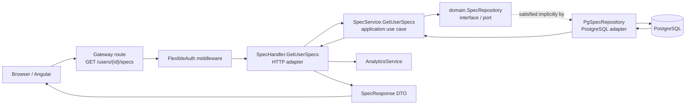
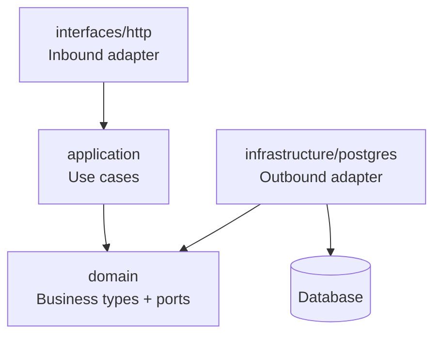
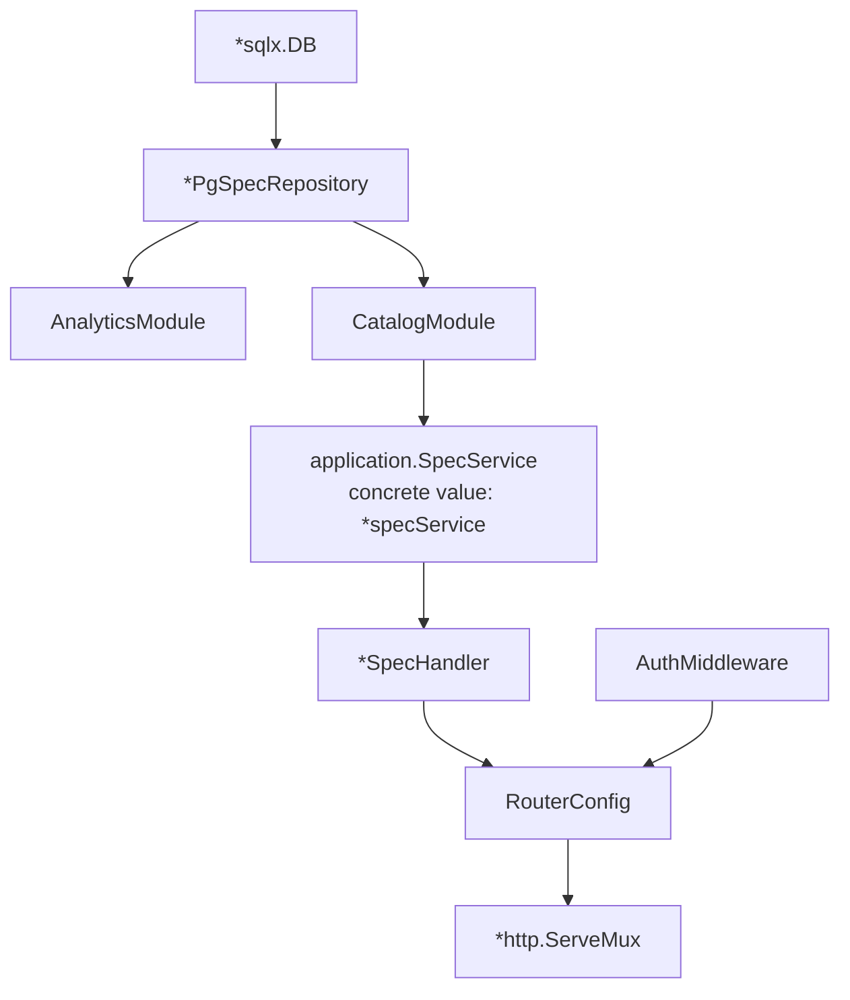
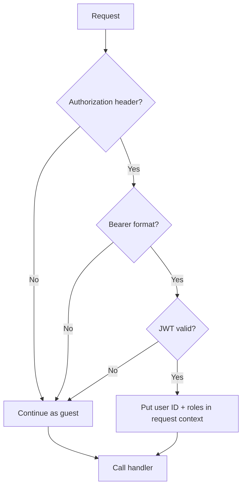
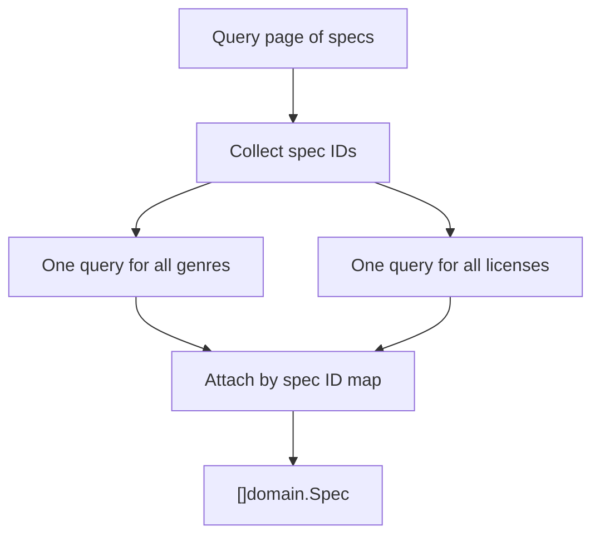
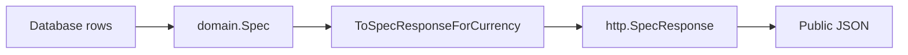

# Public Producer Catalog: Go Backend From Zero to Architecture

This guide explains the real request flow for:

```http
GET /users/{producer-id}/specs?page=1&limit=10
```

It starts with basic Go concepts, then follows this repository's code from server startup to JSON response. The goal is to explain not only **what** happens, but **why the code is split into packages and interfaces**.

---

## 1. The entire flow in one picture



The short version is:

1. The route matches the URL.
2. flexible auth optionally identifies the viewer.
3. the handler understands HTTP.
4. the service applies application rules such as pagination limits.
5. the repository understands PostgreSQL.
6. the handler converts internal domain structs into public response structs.
7. Go's JSON encoder sends the result.

---

## 2. Go foundations

### 2.1 What is a package?

Every Go file begins with a package declaration:

```go
package domain
```

A package is a group of Go files compiled together. Files in the same directory normally belong to the same package and can directly use each other's exported and unexported names.

Examples in this project:

```text
internal/modules/catalog/
├── domain/                         package domain
├── application/                    package application
├── infrastructure/persistence/postgres/ package postgres
└── interfaces/http/                package http
```

Although the folder is named `interfaces/http`, its Go package is named `http`. Because Go already has a standard `net/http` package, callers often give the catalog package an import alias:

```go
import catalogHttp "github.com/.../catalog/interfaces/http"
```

Now the caller writes `catalogHttp.NewSpecHandler(...)` instead of an ambiguous `http.NewSpecHandler(...)`.

### 2.2 Exported versus private names

In Go, capitalization controls visibility:

```go
type SpecService interface {} // exported: other packages can use it
type specService struct {}    // private: only package application can use it
```

This is why the handler can know about `application.SpecService`, but cannot construct or depend directly on `application.specService`.

That is intentional. Other packages depend on the public contract, while the implementation remains replaceable.

### 2.3 What is a struct?

A struct groups related fields:

```go
type Spec struct {
    ID         uuid.UUID
    ProducerID uuid.UUID
    Title      string
    BPM        int
}
```

One value of `Spec` represents one beat/sample in application memory.

Methods can belong to struct types:

```go
func (r *PgSpecRepository) ListByUserID(...) (...) {
    // r is the receiver
}
```

This is roughly similar to an instance method in Java or TypeScript. `r` is the repository object on which the method is called.

### 2.4 What is an interface?

An interface is a required method set:

```go
type SpecRepository interface {
    ListByUserID(
        ctx context.Context,
        producerID uuid.UUID,
        limit int,
        offset int,
    ) ([]Spec, int, error)
}
```

It says:

> Any value having a method with exactly this name and signature can be used as a `SpecRepository`.

An interface generally describes **behavior**, not stored data.

### 2.5 Why there is no `implements` keyword

Go uses implicit interface satisfaction.

The concrete repository defines:

```go
func (r *PgSpecRepository) ListByUserID(
    ctx context.Context,
    producerID uuid.UUID,
    limit, offset int,
) ([]domain.Spec, int, error) {
    // PostgreSQL implementation
}
```

Because `*PgSpecRepository` has all the methods required by `domain.SpecRepository`, it satisfies the interface automatically.

There is no declaration like:

```text
PgSpecRepository implements SpecRepository // not Go syntax
```

The compiler proves the relationship when this happens:

```go
service := application.NewSpecService(repository)
```

`NewSpecService` requires a `domain.SpecRepository`. If `repository` is missing even one required method, or one parameter/return type differs, compilation fails.

An optional explicit compile-time assertion could be added:

```go
var _ domain.SpecRepository = (*PgSpecRepository)(nil)
```

This creates no runtime object. It only asks the compiler to verify the relationship at that line. The current code relies on constructor calls and field assignments to perform the same check.

### 2.6 Pointer receiver versus value receiver

Repository methods use pointer receivers:

```go
func (r *PgSpecRepository) ListByUserID(...)
```

Therefore `*PgSpecRepository` satisfies the interface. A plain `PgSpecRepository` value does not necessarily have the same method set.

The constructor returns a pointer:

```go
func NewSpecRepository(db *sqlx.DB) *PgSpecRepository {
    return &PgSpecRepository{db: db}
}
```

This is the correct value to pass into `NewSpecService`.

### 2.7 What is inside an interface value?

Conceptually, an interface value contains:

```text
(concrete type, concrete value)
```

For this application, the `repo domain.SpecRepository` field conceptually contains:

```text
(*postgres.PgSpecRepository, pointer-to-repository-object)
```

Calling `s.repo.ListByUserID(...)` dispatches to `(*PgSpecRepository).ListByUserID(...)`.

This is runtime polymorphism, but it is type-checked at compile time.

---

## 3. Why the project has many folders

The catalog module follows a layered/ports-and-adapters style.



### `domain`

Contains business concepts and contracts:

- `Spec`, `LicenseOption`, `Genre`
- enums such as `Category` and `ProcessingStatus`
- `SpecRepository` interface
- no HTTP parsing
- no SQL implementation

### `application`

Contains use cases and application rules:

- `SpecService` interface
- private `specService` implementation
- validation
- pagination normalization
- orchestration through the repository contract

### `infrastructure/persistence/postgres`

Contains PostgreSQL-specific implementation:

- SQL queries
- `sqlx`
- database row mapping
- `PgSpecRepository`

### `interfaces/http`

Contains the HTTP adapter:

- reading path/query/body values
- choosing HTTP status codes
- converting domain structs to response DTOs
- JSON encoding
- interfaces for services the handler consumes

### `module.go`

Builds the catalog module by connecting its concrete objects.

### `cmd/server/main.go`

Acts as the application's composition root. It creates the database repository, modules, middleware, handlers, and router.

This separation keeps business code from being permanently tied to HTTP or PostgreSQL.

---

## 4. Startup: how the objects are connected

Before any request arrives, `cmd/server/main.go` constructs the object graph.



The important real code is:

```go
specRepo := catalogPersistence.NewSpecRepository(db)

analyticsModule := analytics.NewModule(db, specRepo, fsModule.Service())

catalogModule := catalog.NewModule(
    db,
    specRepo,
    fsModule.Service(),
    analyticsModule.AnalyticsService,
    notificationModule.Service(),
    redisClient,
)
```

Inside `catalog.NewModule`:

```go
service := application.NewSpecService(repository)

handler := catalogHttp.NewSpecHandler(
    service,
    fileService,
    analyticsService,
    notificationService,
    redisClient,
)
```

This is manual dependency injection. There is no framework or magic container.

The constructors receive dependencies and store them:

```go
type specService struct {
    repo domain.SpecRepository
}

type SpecHandler struct {
    service          application.SpecService
    fileService      FileService
    analyticsService AnalyticsService
    // ...
}
```

At runtime the important chain is:

```text
SpecHandler
  └── service interface
        └── concrete *specService
              └── repo interface
                    └── concrete *PgSpecRepository
                          └── *sqlx.DB
```

---

## 5. Route registration

`internal/gateway/routes.go` registers:

```go
mux.Handle(
    "GET /users/{id}/specs",
    config.AuthMiddleware.FlexibleAuth(
        http.HandlerFunc(config.SpecHandler.GetUserSpecs),
    ),
)
```

Read it from the inside outward:

1. `config.SpecHandler.GetUserSpecs` is a method with the shape `func(http.ResponseWriter, *http.Request)`.
2. `http.HandlerFunc(...)` adapts that function into the standard `http.Handler` interface.
3. `FlexibleAuth(...)` wraps that handler and returns another `http.Handler`.
4. `mux.Handle(...)` stores the wrapped handler for the route pattern.

This is the decorator/middleware pattern:

```text
request -> FlexibleAuth -> GetUserSpecs
```

### Standard library interface involved

The standard library defines approximately:

```go
type Handler interface {
    ServeHTTP(ResponseWriter, *Request)
}
```

`http.HandlerFunc` is a function type with a `ServeHTTP` method, so it satisfies `http.Handler`. This is another example of implicit interface satisfaction.

---

## 6. Flexible auth: guest and signed-in behavior

`FlexibleAuth` does not make a private endpoint public. It enriches an already-public endpoint when valid identity is available.



For this endpoint:

| Viewer | Catalog returned | Public counts | `is_favorited` |
|---|---:|---:|---|
| anonymous | yes | yes | effectively false |
| valid signed-in user | yes | yes | calculated for that viewer |
| invalid/expired token | yes, treated as guest | yes | effectively false |

The middleware stores identity using a derived request context:

```go
ctx := context.WithValue(r.Context(), ContextKeyUserId, claims.UserID)
next.ServeHTTP(w, r.WithContext(ctx))
```

The handler later reads it safely:

```go
currentUserID, ok := r.Context().Value(middleware.ContextKeyUserId).(uuid.UUID)
```

The `ok` value is `false` when the request is anonymous.

### FlexibleAuth versus RequireAuth

| Middleware | Missing/invalid token | Use case |
|---|---|---|
| `FlexibleAuth` | continue as guest | public catalog with optional personalization |
| `RequireAuth` | return 401 | upload, purchase, edit profile, favorite mutation |

### Context is not a global variable

`context.Context` belongs to one request. It also carries cancellation and deadlines. When the client disconnects, database operations receiving `r.Context()` can be cancelled.

This is why `ctx` is passed through every layer:

```text
HTTP request context
  -> handler
  -> service
  -> repository
  -> sqlx/database driver
```

---

## 7. The handler: translating HTTP into a use-case call

The handler method is:

```go
func (h *SpecHandler) GetUserSpecs(
    w http.ResponseWriter,
    r *http.Request,
)
```

Its responsibilities are transport-specific.

### Step 1: read and validate the path

```go
userIDStr := r.PathValue("id")
userID, err := uuid.Parse(userIDStr)
```

The route named the path variable `{id}`, so `PathValue("id")` retrieves it.

If it is not a UUID, the handler returns HTTP 400.

### Step 2: parse pagination

```go
page, _ := strconv.Atoi(q.Get("page"))
limit, _ := strconv.Atoi(q.Get("limit"))
```

The handler accepts `limit` and the alternate name `per_page`. It defaults to `20` when the query is absent or invalid.

### Step 3: call the application service

```go
specs, total, err := h.service.GetUserSpecs(
    r.Context(),
    userID,
    page,
    limit,
)
```

The handler does not know whether the service uses PostgreSQL, an in-memory repository, or a mock. It only knows `application.SpecService`.

### Step 4: obtain optional viewer identity

```go
var currentUserIDPtr *uuid.UUID
if currentUserID, ok := r.Context().Value(...).(uuid.UUID); ok {
    currentUserIDPtr = &currentUserID
}
```

Why a pointer?

- `nil` means anonymous viewer.
- non-`nil` means signed-in viewer.

### Step 5: prepare public responses

For each domain spec, the handler:

1. replaces storage URLs with safe/presigned public URLs;
2. converts the domain model to `SpecResponse`;
3. asks analytics for public counts;
4. includes viewer-specific favorite state when identity exists.

```go
h.sanitizeSpec(&specs[i])

responses[i] = *ToSpecResponseForCurrency(
    &specs[i],
    money.ResolveCurrencyFromRequest(r),
)

analytics, err := h.analyticsService.GetPublicAnalytics(
    r.Context(),
    specs[i].ID,
    currentUserIDPtr,
)
```

### Step 6: encode JSON

```go
json.NewEncoder(w).Encode(map[string]interface{}{
    "data": responses,
    "metadata": map[string]interface{}{
        "total": total,
        "page": page,
        "limit": limit,
        // ...
    },
})
```

Example shape:

```json
{
  "data": [
    {
      "id": "...",
      "producer_id": "...",
      "producer_name": "Blaze",
      "title": "Achilles Heel",
      "bpm": 88,
      "analytics": {
        "play_count": 510,
        "favorite_count": 13,
        "total_download_count": 21,
        "is_favorited": true
      }
    }
  ],
  "metadata": {
    "total": 21,
    "page": 1,
    "limit": 10,
    "offset": 0,
    "total_pages": 3
  }
}
```

---

## 8. The application service

The application package exposes this interface:

```go
type SpecService interface {
    GetUserSpecs(
        ctx context.Context,
        producerID uuid.UUID,
        page, limit int,
    ) ([]domain.Spec, int, error)
}
```

Its private implementation is:

```go
type specService struct {
    repo domain.SpecRepository
}
```

The constructor returns the interface:

```go
func NewSpecService(repo domain.SpecRepository) SpecService {
    return &specService{repo: repo}
}
```

This line proves two interface relationships:

1. the incoming repository must satisfy `domain.SpecRepository`;
2. `*specService` must satisfy `application.SpecService` to be returned.

### The use case itself

```go
func (s *specService) GetUserSpecs(...) (...) {
    page, limit = normalizePageAndLimit(page, limit)
    offset := (page - 1) * limit
    return s.repo.ListByUserID(ctx, producerID, limit, offset)
}
```

The service protects the application from unreasonable pagination:

```go
default page  = 1
default limit = 20
maximum limit = 50
```

For `page=2&limit=10`:

```text
offset = (2 - 1) * 10 = 10
```

The repository receives `limit=10, offset=10`.

The current use case is deliberately thin. That is acceptable: the service is still the correct place for future business rules such as visibility, subscription tiers, or moderation filters.

---

## 9. The domain repository interface

`domain.SpecRepository` is the outbound port used by the application layer:

```go
type SpecRepository interface {
    ListByUserID(
        ctx context.Context,
        producerID uuid.UUID,
        limit, offset int,
    ) ([]Spec, int, error)

    // other catalog persistence operations...
}
```

Why define this interface in `domain` instead of `postgres`?

The application owns the behavior it needs. PostgreSQL is only one adapter capable of providing that behavior.

Conceptually, this allows:

```text
SpecRepository
├── PgSpecRepository
├── InMemorySpecRepository
├── CachedSpecRepository
└── MockSpecRepository
```

No service code must change when the implementation changes.

---

## 10. The PostgreSQL repository

The concrete repository stores a database connection:

```go
type PgSpecRepository struct {
    db *sqlx.DB
}
```

The query begins with specs and joins users to obtain the producer display name:

```sql
SELECT
    s.*,
    u.display_name AS producer_name,
    '' AS producer_handle,
    COUNT(*) OVER() AS total_count
FROM specs s
JOIN users u ON s.producer_id = u.id
WHERE s.producer_id = $1
  AND s.is_deleted = FALSE
ORDER BY s.created_at DESC
LIMIT $2 OFFSET $3
```

### Why `COUNT(*) OVER()`?

It returns the total matching row count alongside the limited page. This lets the API report `total=21` even when only 10 rows were selected.

### Anonymous struct embedding

The query needs all `Spec` fields plus `total_count`, which is not a domain field. The repository defines a temporary local row shape:

```go
var results []struct {
    domain.Spec
    TotalCount int `db:"total_count"`
}
```

`domain.Spec` is embedded. Its fields are promoted into the anonymous struct, and `sqlx` can populate them using `db` tags.

After scanning, the repository copies only `res.Spec` into the domain result. The query-only `TotalCount` does not leak into the domain model.

### Bulk-loading related data

The main query returns specs. Genres and licenses live in related tables.

The repository builds:

```go
specMap := map[uuid.UUID]*domain.Spec{}
specIDs := []uuid.UUID{}
```

It then runs one bulk genre query and one bulk license query for all page IDs, and attaches each result to its parent spec through `specMap`.



This avoids querying genres and licenses separately for every beat.

---

## 11. How struct tags connect Go, SQL, and JSON

The domain struct contains two important tag families:

```go
type Spec struct {
    ProducerID uuid.UUID `json:"producer_id" db:"producer_id"`
    ImageUrl   string    `json:"image_url" db:"image_url"`
}
```

### `db` tags

Used by `sqlx` to map database column names to Go fields:

```text
SQL column producer_id -> Go field ProducerID
```

### `json` tags

Used by `encoding/json` to choose JSON property names:

```text
Go field ProducerID -> JSON key producer_id
```

Tags are metadata strings interpreted by libraries through reflection. They do not execute code themselves.

### Special field types

Examples:

- `uuid.UUID`: strongly typed identifier;
- `*string`: optional value where `nil` means absent;
- `time.Time`: timestamp;
- `pq.StringArray`: PostgreSQL string-array adapter;
- `[]Genre`: one-to-many relation stored in memory after extra queries.

---

## 12. Domain model versus response DTO

The domain model is not sent directly. The handler converts it to `SpecResponse`.



Why keep both?

### Domain model

Represents internal business data. It contains persistence-related and internal fields such as:

- `WavUrl`
- `StemsUrl`
- `DeletedAt`
- `IsDeleted`
- storage currency

### Response DTO

Represents the public API contract. It intentionally controls what leaves the server and adds presentation fields such as:

- `PriceMoney`
- `DisplayPriceMoney`
- public analytics
- sanitized/presigned URLs

This prevents accidental exposure of buyer-only files or internal deletion state.

`ToSpecResponseForCurrency` is an explicit mapper between the two representations.

---

## 13. Why the handler defines other interfaces

`interfaces/http/interfaces.go` defines:

```go
type AnalyticsService interface {
    GetPublicAnalytics(
        ctx context.Context,
        specID uuid.UUID,
        userID *uuid.UUID,
    ) (*analyticsDomain.PublicAnalytics, error)
}
```

This interface is defined near the consumer: the catalog HTTP handler.

The handler says:

> I do not need the entire analytics service. I only need these operations.

The actual analytics service satisfies it implicitly. `catalog.NewModule` passes the concrete analytics service to `NewSpecHandler`, and the compiler checks compatibility.

This gives the handler a narrow dependency and makes tests easy.

The same pattern is used for:

- `FileService`
- `NotificationService`

This is why you may see interfaces in a handler package while the concrete structs live in completely different modules.

---

## 14. End-to-end sequence for one real request

Request:

```http
GET /users/abc-producer-uuid/specs?page=1&limit=10
Authorization: Bearer valid-viewer-token
```

```mermaid
sequenceDiagram
    participant C as Client
    participant M as FlexibleAuth
    participant H as SpecHandler
    participant S as specService
    participant R as PgSpecRepository
    participant D as PostgreSQL
    participant A as AnalyticsService

    C->>M: GET with optional JWT
    M->>M: Validate JWT
    M->>H: Request + viewer ID in context
    H->>H: Parse producer UUID, page, limit
    H->>S: GetUserSpecs(ctx, producerID, 1, 10)
    S->>S: Normalize page/limit; offset=0
    S->>R: ListByUserID(ctx, producerID, 10, 0)
    R->>D: Query specs + total count
    D-->>R: Page rows
    R->>D: Bulk query genres
    D-->>R: Genre rows
    R->>D: Bulk query licenses
    D-->>R: License rows
    R-->>S: []domain.Spec, total
    S-->>H: []domain.Spec, total
    loop each returned spec
        H->>H: Sanitize URLs + map to SpecResponse
        H->>A: GetPublicAnalytics(specID, viewerID)
        A-->>H: counts + is_favorited
    end
    H-->>C: JSON data + pagination metadata
```

---

## 15. Testing proves the architecture

### Handler test

The handler test creates a `mockSpecService` that has the same method set as `application.SpecService`.

It does not use PostgreSQL. The test configures:

```go
specSvc.On(
    "GetUserSpecs",
    mock.Anything,
    userID,
    1,
    20,
).Return(specs, 1, nil)
```

Then it calls the handler with `httptest` and checks HTTP behavior.

### Service test

The service test creates `mockRepo`, a small struct whose methods satisfy `domain.SpecRepository`.

It does not start HTTP or PostgreSQL. This isolates application behavior.

Interfaces make these substitutions possible without changing production code.

---

## 16. Common beginner questions

### “Where is the interface implemented?”

Search for methods matching the interface's signatures. For example:

```text
interface: domain.SpecRepository.ListByUserID
implementation: (*postgres.PgSpecRepository).ListByUserID
```

There is no explicit `implements` declaration.

### “Which concrete object is actually used?”

Follow constructor calls from `cmd/server/main.go`:

```text
NewSpecRepository(db)
  -> catalog.NewModule(...)
  -> NewSpecService(repository)
  -> NewSpecHandler(service, ...)
  -> SetupRoutes(...)
```

### “Why does the handler store an interface instead of a struct?”

It needs behavior, not implementation details. This reduces coupling and permits mocks or alternate implementations.

### “Why are structs defined in several packages?”

They represent different boundaries:

- database/domain representation;
- application input/output;
- HTTP public response;
- analytics response;
- temporary query-row shape.

Two structs can describe related data but serve different purposes.

### “Why return both `[]Spec` and `total`?”

The slice is the current page. `total` is the count across all pages, needed for pagination controls and “21 tracks” labels.

### “Why is an error returned instead of thrown?”

Go normally represents failure as an explicit last return value:

```go
specs, total, err := service.GetUserSpecs(...)
if err != nil {
    // handle failure
}
```

This makes error paths visible in function signatures.

---

## 17. Expert-level observations and possible improvements

The architecture is sound, but understanding its trade-offs is useful.

### 17.1 Analytics currently creates N extra service calls

Genres and licenses are bulk-loaded efficiently, but the handler calls analytics once per returned spec.

For 10 beats, the flow may perform 10 analytics calls. A future batch method could be:

```go
GetPublicAnalyticsBatch(
    ctx context.Context,
    specIDs []uuid.UUID,
    viewerID *uuid.UUID,
) (map[uuid.UUID]PublicAnalytics, error)
```

### 17.2 Handler and service both normalize pagination

The handler establishes friendly HTTP defaults; the service enforces application safety and caps the maximum. Keeping service validation is important because services may later be called outside HTTP.

### 17.3 `is_favorited` cannot distinguish guest from false

The response field is currently:

```go
IsFavorited bool `json:"is_favorited"`
```

Both an anonymous viewer and a signed-in viewer who has not favorited receive `false`. If the frontend ever needs to distinguish those states, use `*bool` with `omitempty`, or include an authentication/viewer-state field.

### 17.4 Optional compile-time assertions improve discoverability

Adding assertions near concrete implementations can make implicit relationships easier to find:

```go
var _ domain.SpecRepository = (*PgSpecRepository)(nil)
var _ application.SpecService = (*specService)(nil)
```

They are not required, but they help readers and detect drift close to the implementation.

### 17.5 A domain entity can be separated further from persistence tags

The current `domain.Spec` includes `db` and `json` tags. This is pragmatic. A stricter clean architecture might use separate database row structs and pure domain entities, at the cost of more mapping code.

There is no universally correct answer; the current design favors less boilerplate.

---

## 18. A mental checklist for tracing any endpoint

When you encounter an unfamiliar endpoint, follow this order:

1. Find the route string in `internal/gateway/routes.go`.
2. Identify middleware wrapped around it.
3. Open the handler method.
4. Find the interface type of each handler field.
5. Open the service method called by the handler.
6. Find the repository interface method called by the service.
7. Search for concrete methods with the same name/signature.
8. Open `module.go` and `cmd/server/main.go` to see the actual object passed at runtime.
9. Follow domain-to-DTO mapping before JSON encoding.
10. Read handler and service tests to see how interfaces are substituted.

Useful searches:

```powershell
rg -n "GET /users/\{id\}/specs" internal
rg -n "GetUserSpecs" internal
rg -n "type SpecService interface" internal
rg -n "type SpecRepository interface" internal
rg -n "func \(r \*PgSpecRepository\) ListByUserID" internal
```

---

## 19. Source map

| Responsibility | File |
|---|---|
| server composition root | `cmd/server/main.go` |
| route registration | `internal/gateway/routes.go` |
| flexible and required auth | `internal/gateway/middleware/auth.go` |
| catalog module wiring | `internal/modules/catalog/module.go` |
| HTTP handler | `internal/modules/catalog/interfaces/http/handler.go` |
| handler dependency interfaces | `internal/modules/catalog/interfaces/http/interfaces.go` |
| public response DTO and mapping | `internal/modules/catalog/interfaces/http/dto.go` |
| service interface and implementation | `internal/modules/catalog/application/service.go` |
| domain structs and repository port | `internal/modules/catalog/domain/spec.go` |
| PostgreSQL implementation | `internal/modules/catalog/infrastructure/persistence/postgres/spec_repo.go` |
| handler mock example | `internal/modules/catalog/interfaces/http/test_mocks_test.go` |
| service mock example | `internal/modules/catalog/application/service_test.go` |

---

## 20. Final mental model

Do not think of the folders as disconnected code. Think of them as a chain of contracts:

```text
HTTP route
  -> handler needs SpecService behavior
  -> specService needs SpecRepository behavior
  -> PgSpecRepository provides that behavior using PostgreSQL
```

Structs carry the data through the chain:

```text
database rows
  -> domain.Spec
  -> application service
  -> SpecResponse DTO
  -> JSON
```

Interfaces connect behaviors. Structs carry state and data. Constructors assemble the concrete runtime graph. Packages enforce boundaries. Go verifies the whole arrangement at compile time without an explicit `implements` keyword.
