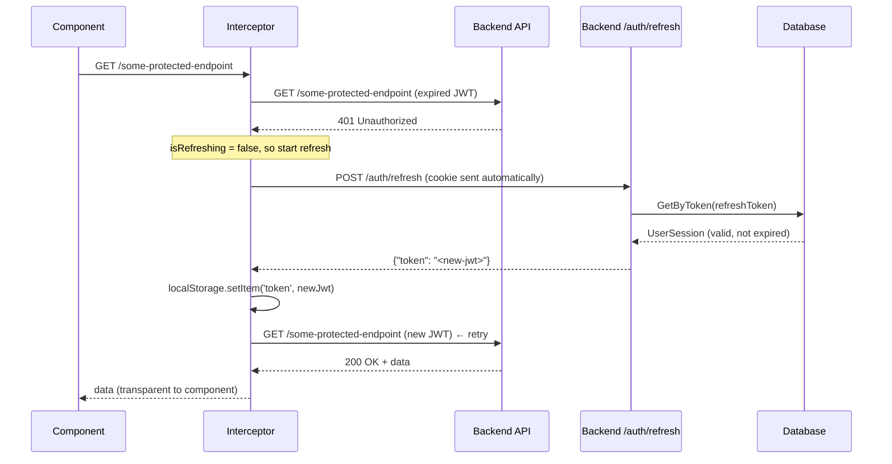
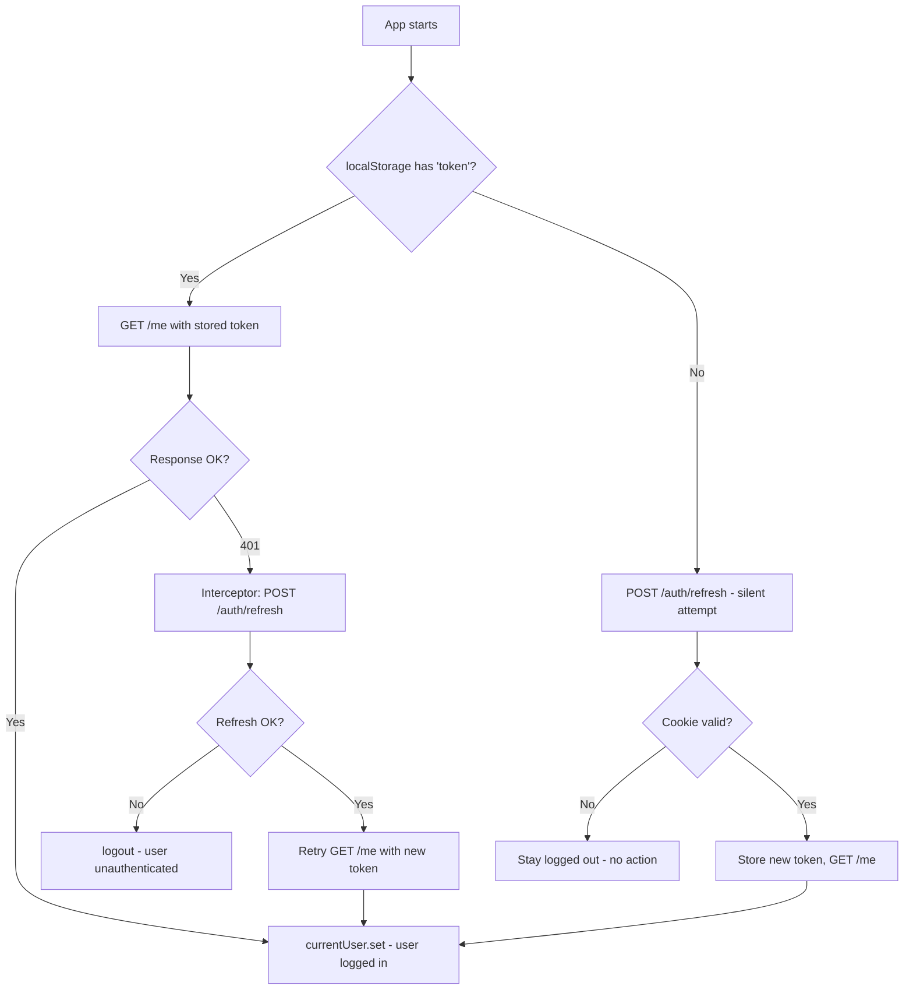

# Auth: Refresh Token & Logout — Architecture Guide

This document explains the complete design of the **refresh token** and **logout** system implemented across the Go backend and Angular frontend.

---

## Table of Contents

1. [Overview](#overview)
2. [Backend Architecture (Go)](#backend-architecture-go)
   - [Configuration](#configuration)
   - [Domain & Repository](#domain--repository)
   - [Application Service](#application-service)
   - [HTTP Handler](#http-handler)
   - [Module & Dependency Injection](#module--dependency-injection)
   - [Router & Server](#router--server)
3. [Frontend Architecture (Angular)](#frontend-architecture-angular)
   - [API Request Classes](#api-request-classes)
   - [AuthService](#authservice)
   - [HTTP Interceptor](#http-interceptor)
4. [Full Flow Diagrams](#full-flow-diagrams)
   - [Login Flow](#login-flow)
   - [API Call with Expired Access Token](#api-call-with-expired-access-token)
   - [App Startup (Silent Refresh)](#app-startup-silent-refresh)
   - [Logout Flow](#logout-flow)
5. [Security Design Decisions](#security-design-decisions)
6. [Environment Variables](#environment-variables)

---

## Overview

The system uses a **dual-token strategy**:

| Token | Storage | Lifetime | Purpose |
|---|---|---|---|
| **Access Token (JWT)** | `localStorage` (client) | Short (e.g., 24h) | Sent in `Authorization: Bearer` header to authenticate API calls |
| **Refresh Token** | `HttpOnly` cookie | Long (e.g., 30 days) | Sent automatically by browser to `/auth/refresh` to get a new access token |

The refresh token is **never accessible by JavaScript** (HttpOnly), protecting it from XSS attacks.

---

## Backend Architecture (Go)

### Configuration

**File:** `internal/shared/infrastructure/config/config.go`

```go
type JWTConfig struct {
    Secret        string
    Expiry        time.Duration  // JWT_EXPIRATION
    RefreshExpiry time.Duration  // JWT_REFRESH_EXPIRATION
}
```

`Load()` reads both from environment variables. `RefreshExpiry` controls how long the refresh token cookie lives and when the DB session entry expires.

---

### Domain & Repository

**File:** `internal/modules/auth/domain/`

```go
// UserSession — the refresh token stored in the database
type UserSession struct {
    ID           uuid.UUID
    UserID       uuid.UUID
    RefreshToken string    // Base64 random token (not a JWT)
    IsRevoked    bool
    ExpiresAt    time.Time
    CreatedAt    time.Time
    UpdatedAt    time.Time
}

// SessionRepository — interface (DB operations)
type SessionRepository interface {
    Create(ctx, *UserSession) error
    GetByToken(ctx, token string) (*UserSession, error)
    Revoke(ctx, token string) error
    RevokeAllForUser(ctx, userID uuid.UUID) error
}
```

The repository is an **interface** — the application layer depends on this abstraction, not the Postgres implementation. This enables easy testing with mocks.

**Postgres Implementation:** `internal/modules/auth/infrastructure/postgres/session_repository.go`

---

### Application Service

**File:** `internal/modules/auth/application/auth_service.go`

The `AuthService` struct holds all dependencies:

```go
type AuthService struct {
    repo              domain.UserRepository
    sessionRepo       domain.SessionRepository  // ← added
    jwtSecret         string
    jwtExpiry         time.Duration
    jwtRefreshExpiry  time.Duration             // ← added
}
```

#### Key Methods

| Method | What it does |
|---|---|
| `Login(ctx, req)` | Validates password → calls `generateSession` → returns `TokenPair` |
| `GoogleLogin(ctx, clientID, req)` | Validates Google token → upserts user → calls `generateSession` → returns `TokenPair` |
| `generateSession(ctx, user)` | Creates a random refresh token, stores it in DB with expiry, signs a JWT, returns `TokenPair` |
| `RefreshSession(ctx, refreshToken)` | Looks up token in DB → validates not revoked/expired → signs a new JWT access token |
| `Logout(ctx, refreshToken)` | Marks the session as `is_revoked = true` in DB |

#### `generateSession` logic

```go
func (s *AuthService) generateSession(ctx, user) (*TokenPair, error) {
    // 1. Generate 32 random bytes → base64 string = refresh token
    refreshToken := generateRandomToken()

    // 2. Store session in DB (expires after jwtRefreshExpiry)
    session := &domain.UserSession{
        UserID:       user.ID,
        RefreshToken: refreshToken,
        ExpiresAt:    time.Now().Add(s.jwtRefreshExpiry),
    }
    s.sessionRepo.Create(ctx, session)

    // 3. Sign JWT access token (expires after jwtExpiry)
    accessToken := signJWT(user, s.jwtSecret, s.jwtExpiry)

    return &TokenPair{AccessToken: accessToken, RefreshToken: refreshToken}, nil
}
```

#### `TokenPair` (returned from Login/GoogleLogin)

```go
type TokenPair struct {
    AccessToken  string  // short-lived JWT
    RefreshToken string  // long-lived random token stored in DB
}
```

---

### HTTP Handler

**File:** `internal/modules/auth/interfaces/http/auth_handler.go`

```go
type AuthHandler struct {
    service        AuthService         // interface, not concrete type
    fileService    FileService
    googleClientID string
    refreshExpiry  time.Duration       // ← used for cookie Max-Age
}
```

#### Endpoints

| Method + Path | Handler | What it does |
|---|---|---|
| `POST /login` | `Login` | Calls service, sets `refresh_token` HttpOnly cookie, returns `{"token": "<jwt>"}` |
| `POST /register` | `Register` | Creates user (no session) |
| `GET /me` | `Me` | Returns current user (requires JWT) |
| `POST /auth/google` | `GoogleLogin` | OAuth login, sets cookie + returns JWT |
| `POST /auth/refresh` | `Refresh` | Reads cookie → calls `RefreshSession` → returns new JWT |
| `POST /auth/logout` | `Logout` | Reads cookie → revokes DB session → clears cookie |

#### Cookie Set on Login/GoogleLogin

```go
http.SetCookie(w, &http.Cookie{
    Name:     "refresh_token",
    Value:    tokens.RefreshToken,
    Path:     "/",
    Expires:  time.Now().Add(h.refreshExpiry),  // from config
    HttpOnly: true,   // ← not accessible by JS
    Secure:   true,   // ← HTTPS only
    SameSite: http.SameSiteStrictMode,
})
```

#### Cookie Cleared on Logout

```go
http.SetCookie(w, &http.Cookie{
    Name:   "refresh_token",
    Value:  "",
    MaxAge: -1,  // ← tells browser to delete immediately
})
```

---

### Module & Dependency Injection

**File:** `internal/modules/auth/module.go`

```go
func NewModule(db, jwtSecret, jwtExpiry, jwtRefreshExpiry, fileService, googleClientID) (*Module, error) {
    userRepo    := postgres.NewUserRepository(db)
    sessionRepo := postgres.NewSessionRepository(db)   // ← wired here

    service := application.NewAuthService(
        userRepo, sessionRepo, jwtSecret, jwtExpiry, jwtRefreshExpiry,
    )
    handler := http.NewAuthHandler(
        service, fileService, googleClientID, jwtRefreshExpiry,
    )

    return &Module{service, handler, userRepo}, nil
}
```

`NewModule` is the **composition root** for the auth domain. It:
1. Creates concrete repository implementations (Postgres)
2. Injects them into `AuthService`
3. Injects the service into `AuthHandler`
4. Returns the assembled module

No global state — everything flows through constructor arguments.

---

### Router & Server

**File:** `cmd/server/main.go`

```go
cfg := config.Load()  // reads .env

authModule, _ := auth.NewModule(
    db,
    cfg.JWT.Secret,
    cfg.JWT.Expiry,
    cfg.JWT.RefreshExpiry,  // ← flows from config down to handler/service
    fileService,
    cfg.GoogleClientID,
)
```

**File:** `internal/gateway/router.go`

```go
mux.HandleFunc("POST /auth/refresh", authHandler.Refresh)
mux.HandleFunc("POST /auth/logout",  authHandler.Logout)
mux.HandleFunc("POST /login",        authHandler.Login)
mux.HandleFunc("POST /auth/google",  authHandler.GoogleLogin)
// Protected routes use JWT middleware:
mux.HandleFunc("GET /me", middleware.Auth(authHandler.Me, jwtSecret))
```

---

## Frontend Architecture (Angular)

### API Request Classes

**File:** `src/app/core/api/auth.requests.ts`

Each API call is a typed class. The `ApiService` executes them generically.

```typescript
class RefreshRequest implements ApiRequest<{token: string}> {
    path = '/auth/refresh';
    method = 'POST';
    // No body needed — browser sends the HttpOnly cookie automatically
    // because ApiService uses withCredentials: true
}

class LogoutApiRequest implements ApiRequest<void> {
    path = '/auth/logout';
    method = 'POST';
}
```

---

### AuthService

**File:** `src/app/services/auth.service.ts`

```typescript
@Injectable({ providedIn: 'root' })
export class AuthService {
    currentUser = signal<User | null>(null);  // reactive state

    constructor() {
        this.checkSession();  // runs on app startup
    }
}
```

#### `checkSession()` — Startup Logic

```typescript
checkSession() {
    const token = localStorage.getItem('token');
    if (token) {
        // Access token exists → validate it by fetching user profile
        this.getMe().subscribe();
    } else {
        // No access token → try silent refresh using the cookie
        this.refreshToken().pipe(
            switchMap(() => this.getMe()),
            catchError(() => of(null)),  // cookie expired → stay logged out
        ).subscribe();
    }
}
```

#### `refreshToken()`

```typescript
refreshToken() {
    return this.api.execute(new RefreshRequest()).pipe(
        tap((res) => {
            localStorage.setItem('token', res.token);  // store new access token
        }),
    );
}
```

#### `logout()`

```typescript
logout() {
    // 1. Tell backend to revoke session + clear HttpOnly cookie
    this.api.execute(new LogoutApiRequest()).subscribe();

    // 2. Clear local state immediately (don't wait for API)
    localStorage.removeItem('token');
    this.currentUser.set(null);

    // 3. Sign out of Google to prevent re-login loop
    this.socialAuthService.signOut().catch(() => {});

    // 4. Redirect
    this.router.navigate(['/login']);
}
```

---

### HTTP Interceptor

**File:** `src/app/core/interceptors/auth.interceptor.ts`

This is a **functional interceptor** registered globally. It runs on every HTTP request.

```typescript
export const authInterceptor: HttpInterceptorFn = (req, next) => {
    const token = localStorage.getItem('token');

    // Attach Bearer token to every request
    const authReq = token
        ? req.clone({ setHeaders: { Authorization: `Bearer ${token}` } })
        : req;

    return next(authReq).pipe(
        catchError((error: HttpErrorResponse) => {
            // Don't intercept auth endpoints to avoid infinite loops
            if (isAuthUrl(req.url)) return throwError(() => error);

            if (error.status === 401) {
                return handle401(authService, req, next);
            }

            return throwError(() => error);
        })
    );
};
```

#### `handle401` — The Refresh Logic

```typescript
// Module-level state (shared across all concurrent requests)
let isRefreshing = false;
const refreshTokenSubject = new BehaviorSubject<string | null>(null);

function handle401(authService, req, next) {
    if (!isRefreshing) {
        isRefreshing = true;
        refreshTokenSubject.next(null);  // signal "refreshing in progress"

        return authService.refreshToken().pipe(
            switchMap((res) => {
                isRefreshing = false;
                refreshTokenSubject.next(res.token);  // unblock waiting requests
                // Retry original request with new token
                return next(req.clone({ setHeaders: { Authorization: `Bearer ${res.token}` } }));
            }),
            catchError((err) => {
                isRefreshing = false;
                authService.logout();  // refresh failed → force logout
                return throwError(() => err);
            }),
        );
    } else {
        // Another request is already refreshing — wait for it
        return refreshTokenSubject.pipe(
            filter(token => token !== null),
            take(1),
            switchMap(newToken => next(req.clone({
                setHeaders: { Authorization: `Bearer ${newToken}` }
            }))),
        );
    }
}
```

The `BehaviorSubject` pattern prevents a **token refresh race condition**: if 5 requests fire simultaneously after the token expires, only 1 refresh call is made; the other 4 wait and then all retry with the new token.

---

## Full Flow Diagrams

### Login Flow

```mermaid
sequenceDiagram
    participant Browser
    participant Angular (AuthService)
    participant Backend (AuthHandler)
    participant Backend (AuthService)
    participant Database

    Browser->>Angular (AuthService): login(email, password)
    Angular (AuthService)->>Backend (AuthHandler): POST /login {email, password}
    Backend (AuthHandler)->>Backend (AuthService): Login(ctx, req)
    Backend (AuthService)->>Database: GetByEmail(email)
    Database-->>Backend (AuthService): User row
    Backend (AuthService)->>Backend (AuthService): bcrypt.Compare(password, hash)
    Backend (AuthService)->>Backend (AuthService): generateSession(user)
    Backend (AuthService)->>Database: INSERT INTO user_sessions (refresh_token, expires_at...)
    Backend (AuthService)-->>Backend (AuthHandler): TokenPair {accessToken, refreshToken}
    Backend (AuthHandler)->>Browser: Set-Cookie: refresh_token=...; HttpOnly; Secure
    Backend (AuthHandler)-->>Angular (AuthService): {"token": "<jwt>"}
    Angular (AuthService)->>Angular (AuthService): localStorage.setItem('token', jwt)
    Angular (AuthService)->>Backend (AuthHandler): GET /me
    Backend (AuthHandler)-->>Angular (AuthService): User profile
    Angular (AuthService)->>Angular (AuthService): currentUser.set(user)
```

---

### API Call with Expired Access Token



---

### App Startup (Silent Refresh)



---

### Logout Flow

```mermaid
sequenceDiagram
    participant User
    participant Angular (AuthService)
    participant Backend (AuthHandler)
    participant Backend (AuthService)
    participant Database
    participant Browser Cookie Store

    User->>Angular (AuthService): logout()
    Angular (AuthService)->>Backend (AuthHandler): POST /auth/logout (cookie sent automatically)
    Backend (AuthHandler)->>Backend (AuthService): Logout(ctx, refreshToken)
    Backend (AuthService)->>Database: UPDATE user_sessions SET is_revoked=true
    Database-->>Backend (AuthService): OK
    Backend (AuthHandler)->>Browser Cookie Store: Set-Cookie: refresh_token=; MaxAge=-1 (delete)
    Backend (AuthHandler)-->>Angular (AuthService): 200 OK

    Angular (AuthService)->>Angular (AuthService): localStorage.removeItem('token')
    Angular (AuthService)->>Angular (AuthService): currentUser.set(null)
    Angular (AuthService)->>Angular (AuthService): router.navigate(['/login'])
```

---

## Security Design Decisions

| Decision | Reason |
|---|---|
| Refresh token in **HttpOnly cookie** | JavaScript cannot read it → safe from XSS attacks |
| Refresh token in **DB** (not JWT) | Can be explicitly revoked on logout or compromise |
| `SameSite: Strict` on cookie | Prevents CSRF — cookie is only sent from same origin |
| `Secure: true` on cookie | Cookie only transmitted over HTTPS |
| **Short-lived access token** | If a JWT is stolen, it expires quickly and can't be refreshed without the HttpOnly cookie |
| **Access token in `localStorage`** | Sent only via `Authorization` header (not auto-sent like cookie), simplifying CORS |
| **Interceptor at HTTP layer** | Token refresh is fully transparent to business logic components |
| **BehaviorSubject queueing** | Prevents stampede: N concurrent 401s → 1 refresh call, N retries |

---

## Environment Variables

| Variable | Example | Description |
|---|---|---|
| `JWT_SECRET` | `abc123...` | HMAC signing key for access tokens |
| `JWT_EXPIRATION` | `24h` / `30s` (dev) | How long the access token (JWT) is valid |
| `JWT_REFRESH_EXPIRATION` | `720h` / `30s` (dev) | How long the refresh token & cookie live |

> For local testing set both to `30s` to observe the full refresh cycle quickly. For production use `24h` / `720h`.
