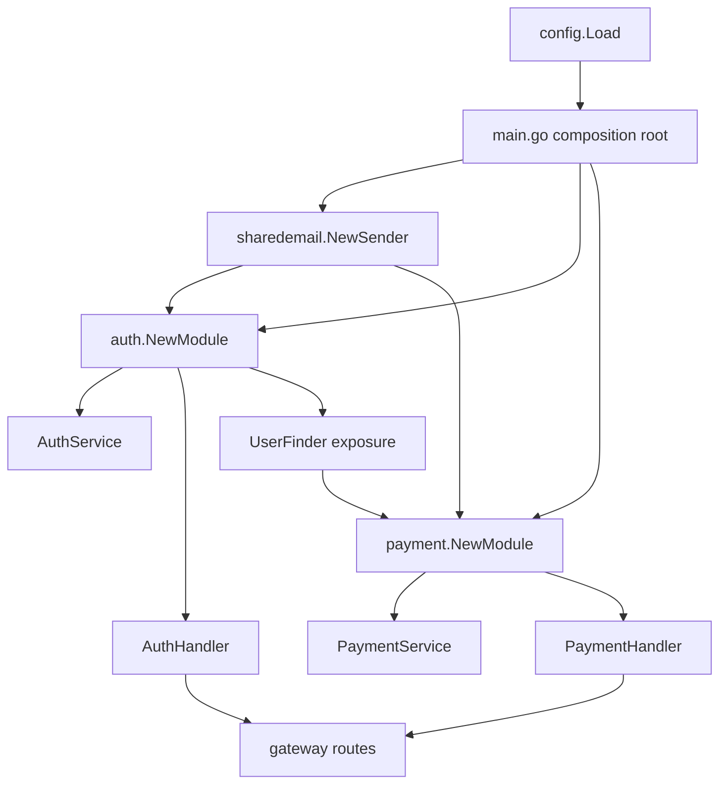
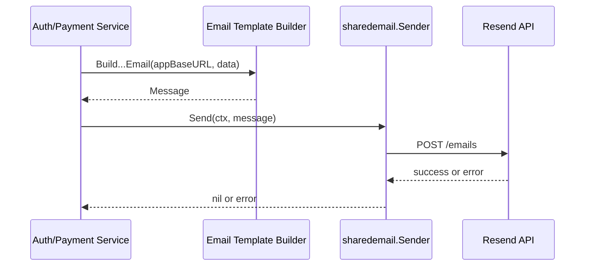
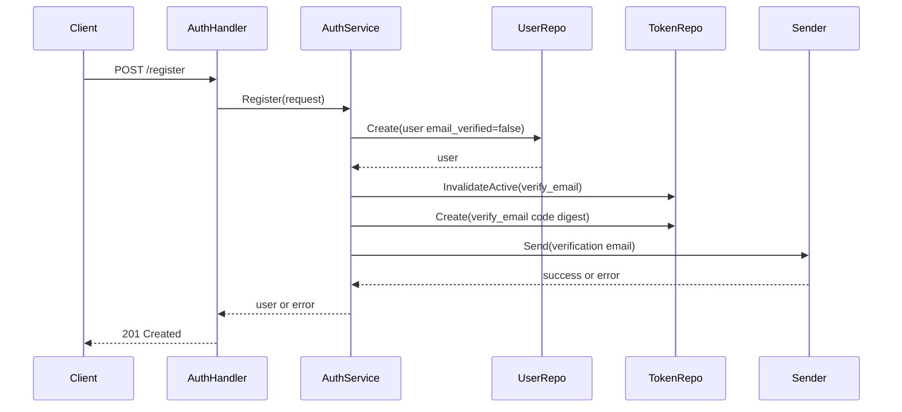
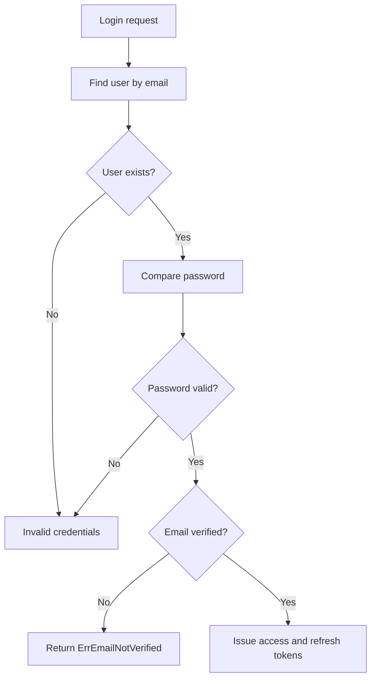
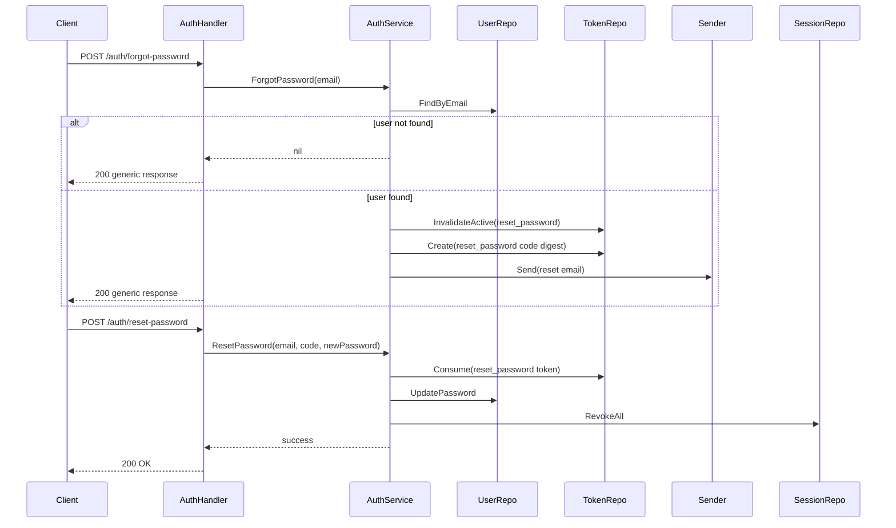
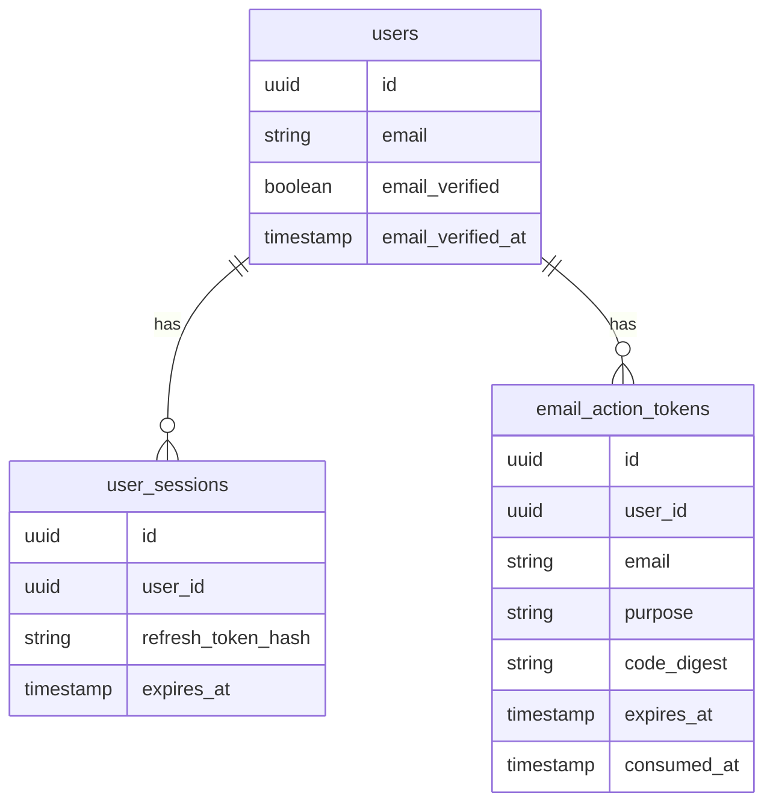
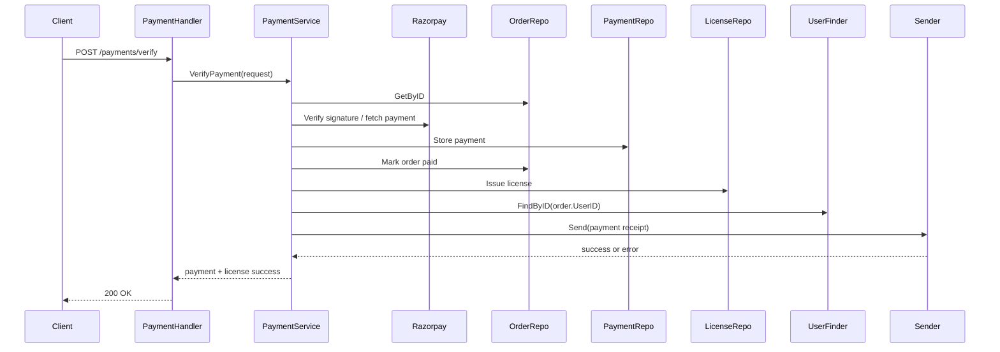

# Backend Email Architecture

## Purpose

This document explains the backend email integration that was added to `blueprint-backend` for:

- registration verification
- OTP-style email code verification
- forgot-password / reset-password
- payment receipt emails with a frontend download or license link

The goal is not just to list file changes. This walks through:

- what changed
- why it changed
- where each piece lives
- how dependency injection was introduced
- how the runtime flow moves from bootstrap to HTTP handler to application service to persistence to Resend

This is written as a maintainer guide for someone who did not implement the feature.

---

## Before Vs After

### Before

The backend already had:

- local registration and login
- Google login
- JWT access and refresh sessions
- payment verification and license issuance

It did **not** have:

- outbound email infrastructure
- email verification state on users
- one-time email action tokens
- forgot-password flow
- receipt emails after purchase

### After

The system now has:

- a shared email sender abstraction backed by Resend
- centralized email templates
- email-related config in shared config/bootstrap
- email verification state on `users`
- a dedicated `email_action_tokens` table for one-time verification/reset codes
- new auth use cases for verify/resend/forgot/reset
- receipt email sending after successful payment verification

---

## High-Level Change Map

### Bootstrap / Composition Root

- [cmd/server/main.go](../cmd/server/main.go)

### Shared Infrastructure

- [internal/shared/infrastructure/config/config.go](../internal/shared/infrastructure/config/config.go)
- [internal/shared/infrastructure/email/email.go](../internal/shared/infrastructure/email/email.go)
- [internal/shared/infrastructure/email/templates.go](../internal/shared/infrastructure/email/templates.go)

### Auth Module

- [internal/modules/auth/module.go](../internal/modules/auth/module.go)
- [internal/modules/auth/domain/user.go](../internal/modules/auth/domain/user.go)
- [internal/modules/auth/domain/email_token.go](../internal/modules/auth/domain/email_token.go)
- [internal/modules/auth/application/auth_service.go](../internal/modules/auth/application/auth_service.go)
- [internal/modules/auth/interfaces/http/auth_handler.go](../internal/modules/auth/interfaces/http/auth_handler.go)
- [internal/modules/auth/infrastructure/persistence/postgres/user_repo.go](../internal/modules/auth/infrastructure/persistence/postgres/user_repo.go)
- [internal/modules/auth/infrastructure/persistence/postgres/email_token_repo.go](../internal/modules/auth/infrastructure/persistence/postgres/email_token_repo.go)

### Payment Module

- [internal/modules/payment/module.go](../internal/modules/payment/module.go)
- [internal/modules/payment/application/service.go](../internal/modules/payment/application/service.go)

### Gateway / Routing

- [internal/gateway/routes.go](../internal/gateway/routes.go)

### Migrations

- [db/migrations/000025_add_email_verification_to_users.up.sql](../db/migrations/000025_add_email_verification_to_users.up.sql)
- [db/migrations/000026_create_email_action_tokens.up.sql](../db/migrations/000026_create_email_action_tokens.up.sql)

### Runtime / Deployment Support

- [docker-compose.yml](../docker-compose.yml)
- [.env.example](../.env.example)

---

## Architecture In One Picture



This is the central design decision: `main.go` became the place where email capability is created once and injected into modules that need it.

---

## Composition Root And DI

The email feature starts in [cmd/server/main.go](../cmd/server/main.go).

### What changed in bootstrap

`main.go` now does these extra steps:

1. Load email config from shared config.
2. Create a shared email sender using `sharedemail.NewSender(...)`.
3. Pass that sender into the auth module.
4. Pass that same sender into the payment module.
5. Pass `cfg.AppBaseURL` into both modules so they can generate links in emails.
6. Pass `authModule.UserFinder()` into payment so payment can find buyer data without reaching into auth internals directly.

### Why `main.go` is the right place

`main.go` is the composition root. That means it is where concrete infrastructure is assembled and injected into abstract business services.

This is exactly where these decisions belong:

- which email provider is used
- whether the sender is a noop sender or a live Resend sender
- which modules receive the sender
- what base URL should be used for email links

If this logic lived inside auth or payment packages, those modules would be tightly coupled to environment loading and provider construction.

### Actual DI decisions

#### Email sender

Injected into:

- `auth.NewModule(...)`
- `payment.NewModule(...)`

Why:

- both modules need outbound email
- they should not know how Resend works
- they should depend on a small capability, not a concrete provider

#### App base URL

Injected into:

- auth module
- payment module

Why:

- email links are content, not persistence
- template builders need a frontend base URL for `/verify-email`, `/reset-password`, and `/licenses`
- keeping this injected avoids hardcoding frontend URLs inside services

#### User finder

Injected from auth into payment:

- `authModule.UserFinder()` is passed into `payment.NewModule(...)`

Why:

- payment needs buyer email for receipt sending
- payment should not import auth persistence internals
- a narrow finder contract is enough

This is good DI because payment depends on a capability, not on auth’s database implementation.

---

## Shared Infrastructure

## Config Additions

Email config was added in [internal/shared/infrastructure/config/config.go](../internal/shared/infrastructure/config/config.go).

New env-backed settings:

- `RESEND_API_KEY`
- `EMAIL_FROM`
- `EMAIL_REPLY_TO`
- `EMAIL_ENABLED`
- `APP_BASE_URL`

### Why config lives here

This project keeps environment loading in shared infrastructure. Email config belongs here because:

- it is infrastructure concern
- multiple modules need it
- it should be parsed once, near startup

---

## Email Sender Abstraction

The provider integration lives in [internal/shared/infrastructure/email/email.go](../internal/shared/infrastructure/email/email.go).

### Main types

- `Sender` interface
- `Message`
- `Recipient`
- `Config`
- `noopSender`
- `resendSender`

### The core contract

The important abstraction is:

```go
type Sender interface {
    Send(ctx context.Context, msg Message) error
}
```

Everything above this layer only knows how to send a semantic email message. It does **not** know about:

- Resend HTTP endpoints
- authorization headers
- JSON payload shape
- provider-specific response handling

### Why the interface exists

Without this abstraction:

- auth service would build HTTP requests directly
- payment service would duplicate provider logic
- tests would become harder
- changing providers later would affect multiple modules

With this abstraction:

- auth and payment share a single capability
- provider details are isolated
- noop mode is easy
- mocking is easy in tests

### Why there is a noop sender

`NewSender(cfg Config)` returns a noop sender when the feature is effectively unavailable.

That happens when:

- `EMAIL_ENABLED` is false
- `RESEND_API_KEY` is missing
- `EMAIL_FROM` is missing

Why this is useful:

- local/dev environments can run without breaking auth/payment flows
- registration and payment logic still work
- email is treated as optional infrastructure when disabled
- debugging is easier because the app logs whether sender bootstrapped as live or noop

This design is intentionally resilient.

---

## Email Templates

Template builders live in [internal/shared/infrastructure/email/templates.go](../internal/shared/infrastructure/email/templates.go).

Current builders:

- `BuildVerificationEmail`
- `BuildPasswordResetEmail`
- `BuildPaymentReceiptEmail`

### Why templates are separate from sender transport

This is a very important boundary.

The sender is responsible for:

- talking to Resend
- serializing request bodies
- sending HTTP requests

The template builders are responsible for:

- subject line
- HTML body
- plain text body
- link generation

This separation prevents the application services from building raw email payloads inline.

That gives three advantages:

1. Services stay focused on business orchestration.
2. Email copy/layout can evolve independently.
3. The provider adapter stays generic.

### Why link creation is centralized

`buildLink(appBaseURL, path, params)` centralizes frontend link generation.

That avoids duplicate string concatenation in auth and payment flows and makes it clear that:

- auth links point to frontend pages
- payment receipt links point to the app’s licenses area

---

## Email Send Path



This is the core reusable email path used by both auth and payment.

---

## Auth Architecture

The email verification and forgot-password features are fundamentally auth concerns, so most of the behavior lives inside the auth module.

That module spans several layers:

- domain
- persistence
- application
- HTTP interface
- gateway route registration

---

## Auth Domain Layer

### User verification state

[internal/modules/auth/domain/user.go](../internal/modules/auth/domain/user.go) was extended with:

- `EmailVerified bool`
- `EmailVerifiedAt *time.Time`

### Why this belongs on `User`

Verification is part of identity/account state. It is not just transport metadata and not just an auth-service side table concern.

It affects core auth behavior:

- whether password login is allowed
- whether resend verification should send
- whether Google-created users should be considered trusted

That makes it a property of the user aggregate.

### New repository capabilities

`UserRepository` was extended to support:

- `MarkEmailVerified(...)`
- `UpdatePassword(...)`

Why:

- verification and reset flows need domain-level repository operations
- these are persistent state changes tied to auth behavior

### User finder

`UserFinder` exists as a narrower contract for read access.

Why:

- payment only needs to find a user
- it should not depend on the full write-capable auth repository

This is a clean dependency boundary.

---

## Email Action Token Domain

The new token model lives in [internal/modules/auth/domain/email_token.go](../internal/modules/auth/domain/email_token.go).

### What it models

It defines:

- `TokenPurposeVerifyEmail`
- `TokenPurposeResetPassword`
- `EmailActionToken`
- `EmailActionTokenRepository`

### Why a dedicated token model was added

Verification and reset codes are:

- short-lived
- single-use
- purpose-specific
- distinct from refresh sessions

They do not belong in `user_sessions`.

`user_sessions` represent authentication sessions.

`email_action_tokens` represent one-time proof-of-email actions.

These are different concepts with different lifecycle rules.

### Why purpose is explicit

Using a purpose field allows one shared token mechanism to support multiple flows without creating separate tables and repositories for each:

- verify email
- reset password

This keeps the architecture smaller while still being explicit.

---

## Auth Persistence Layer

### User repo updates

In [internal/modules/auth/infrastructure/persistence/postgres/user_repo.go](../internal/modules/auth/infrastructure/persistence/postgres/user_repo.go), persistence was updated so the database can:

- store `email_verified`
- store `email_verified_at`
- mark a user verified
- update the hashed password during reset

### Email token repo

[internal/modules/auth/infrastructure/persistence/postgres/email_token_repo.go](../internal/modules/auth/infrastructure/persistence/postgres/email_token_repo.go) is the persistence implementation for one-time email codes.

### Important behavior in the repo

#### Codes are stored as digests, not plaintext

The raw verification/reset code is generated in the application layer, but the repo stores only a digest in `CodeDigest`.

Why:

- reduces the blast radius if the DB is exposed
- follows the same principle as hashing secrets instead of storing them directly
- plaintext OTP storage is avoidable and unnecessary

#### Active codes are invalidated before a new one is created

`InvalidateActive(...)` consumes older active tokens for the same user and purpose before a new one is stored.

Why:

- avoids multiple valid codes floating around
- makes resend behavior predictable
- reduces support confusion

#### Consume is single-use

`Consume(...)` marks the token as consumed as part of the lookup/update path.

Why:

- token replay should fail
- verification and reset should only be usable once

This is the core single-use guarantee.

---

## Auth Application Layer

The orchestration lives in [internal/modules/auth/application/auth_service.go](../internal/modules/auth/application/auth_service.go).

This file is the heart of the feature.

### Constructor changes

The auth service now receives:

- `userRepo`
- `sessionRepo`
- `tokenRepo`
- `emailSender`
- `appBaseURL`
- JWT config values

That constructor shape reflects the new use cases:

- we need persistence for users
- we need persistence for email action tokens
- we need to send emails
- we need a frontend base URL to build links

### Why this logic belongs in application service

The auth service is where business orchestration belongs because it combines:

- validation
- repo calls
- token generation
- security rules
- email sending
- session revocation

Putting this in handlers would mix HTTP concerns with business logic.
Putting this in repositories would mix orchestration with storage.

Application service is the right layer for “do this use case end-to-end.”

---

## Registration Flow

### What changed

`Register(...)` now:

1. validates input
2. hashes password
3. creates the user with `EmailVerified: false`
4. stores the user
5. attempts to send a verification code email

### Why registration succeeds even if email sending fails

Registration is treated as account creation.
Email dispatch is a follow-up capability.

If email sending temporarily fails:

- the account still exists
- the user can request resend verification later
- the API avoids creating duplicate users from repeated retries

This is a deliberate resilience choice.

### Registration + Verification Sequence



Notice the key design choice: email failure does not roll back user creation.

---

## Login Decision Logic

### What changed

`Login(...)` now blocks local password login when:

- user exists
- password is correct
- `EmailVerified` is false

It returns a domain error for unverified email.

### Why this belongs in login service logic

The verification gate is an authentication rule, not an HTTP rule.
Every caller of the login use case should receive the same behavior.



---

## Google Login Behavior

`GoogleLogin(...)` now treats verified Google identities differently.

If Google reports the email as verified, the local user is created with:

- `EmailVerified: true`
- verification email skipped

Why:

- the external identity provider already performed email verification
- forcing a second local verification would be redundant and friction-heavy

This is an example of business logic living in application service, not in persistence.

---

## Verify Email Flow

`VerifyEmail(...)` in the auth service:

1. finds and consumes a `verify_email` token
2. marks the user verified
3. stamps `email_verified_at`

### Why consume before finalizing

Single-use behavior matters. If two clients try the same code, only one should succeed.

This is why the token repository provides a consume operation rather than just a read operation.

---

## Resend Verification Flow

`ResendVerification(...)` is intentionally generic.

Behavior:

- if user does not exist, return success-like behavior
- if user is already verified, do nothing
- if user exists and is unverified, generate a new code and send it

### Why the endpoint is generic

Returning the same shape whether the user exists or not reduces account enumeration risk.

Attackers should not be able to confirm whether an email is registered based on endpoint behavior.

---

## Forgot Password Flow

`ForgotPassword(...)` works similarly to resend verification:

- unknown email returns generic success behavior
- known email gets a reset token and reset email

### Why this is separate from login/session logic

Password reset is an account recovery use case.
It should not depend on the user already having a valid session.

### Forgot Password + Reset Password Sequence



### Why sessions are revoked after reset

If a password is reset because the old credential is compromised, existing refresh sessions should not continue to work.

That makes reset-password a security boundary, not just a field update.

---

## Auth HTTP Layer

HTTP mapping lives in [internal/modules/auth/interfaces/http/auth_handler.go](../internal/modules/auth/interfaces/http/auth_handler.go).

### What handlers are responsible for

Handlers should do edge concerns only:

- parse request body
- call application service
- map domain/application errors to HTTP status codes
- shape HTTP response body

They should **not**:

- generate tokens
- send emails directly
- update DB state directly

That is why verification and reset orchestration is absent from handlers and concentrated in the service.

### New auth endpoints

Registered in [internal/gateway/routes.go](../internal/gateway/routes.go):

- `POST /auth/verify-email`
- `POST /auth/resend-verification`
- `POST /auth/forgot-password`
- `POST /auth/reset-password`

### Why routes are added in gateway

The gateway is the HTTP assembly point for the application.
Modules expose handlers, and the gateway binds them to concrete paths.

That keeps route topology centralized.

---

## Database Changes

Two migrations were added.

## `000025_add_email_verification_to_users`

File:
[db/migrations/000025_add_email_verification_to_users.up.sql](../db/migrations/000025_add_email_verification_to_users.up.sql)

### Intent

Add persistent user verification state:

- `email_verified`
- `email_verified_at`

### Why old users were backfilled as verified

Existing accounts were created before verification was enforced.
If they were suddenly treated as unverified, old users would get locked out of the app.

So the migration backfilled them as verified to preserve backward compatibility.

This is a very practical migration choice.

## `000026_create_email_action_tokens`

File:
[db/migrations/000026_create_email_action_tokens.up.sql](../db/migrations/000026_create_email_action_tokens.up.sql)

### Intent

Create a dedicated table for short-lived one-time email action codes.

### Why a separate table exists

Because these tokens have their own lifecycle:

- expiration
- purpose
- single-use consumption
- invalidation on resend

Those rules are different from refresh-token sessions.

### Data Relationships



---

## Payment Receipt Integration

Auth email and payment email share infrastructure, but they are not the same kind of business event.

Auth emails are often part of access control.
Payment receipts are post-purchase notifications.

This is why the payment integration is intentionally best-effort.

### Module-level DI

In [internal/modules/payment/module.go](../internal/modules/payment/module.go), the payment module now receives:

- `userFinder`
- `fileService`
- `emailSender`
- `appBaseURL`

### Why payment needs `userFinder`

Orders and payments do not necessarily carry every buyer-facing email detail the service wants to use for the receipt.
The payment service may need to resolve the buyer from the user module.

Using `UserFinder` keeps that dependency narrow and read-only.

### Why payment gets the shared sender directly

Payment is its own module with its own use case.
It should be able to trigger its own notification without routing through auth.

That keeps module boundaries clean:

- auth owns auth flows
- payment owns payment flows
- shared infrastructure provides reusable capabilities

### Verify Payment + Receipt Sequence



### Why receipt send failure does not fail payment verification

In [internal/modules/payment/application/service.go](../internal/modules/payment/application/service.go), receipt sending is best-effort.

The source of truth for a successful purchase is:

- payment persisted
- order marked paid
- license issued

Email is a notification side effect.

If Resend is temporarily down, the customer still paid and must still own the license.

This is why the service logs receipt send failure but does not roll back the purchase.

That is one of the most important business decisions in the whole integration.

---

## Why Each Piece Lives Where It Does

This section answers the “why here?” question directly.

### `internal/shared/infrastructure/email/*`

Why here:

- Resend integration is infrastructure
- it is shared across modules
- it should not belong to auth or payment specifically

### `internal/shared/infrastructure/config/config.go`

Why here:

- env loading is shared infrastructure
- email config is not domain logic

### `internal/modules/auth/domain/*`

Why here:

- verification state and reset/verification token purposes are auth concepts
- they affect identity and login policy

### `internal/modules/auth/infrastructure/persistence/postgres/*`

Why here:

- token storage and user field persistence are database implementation details
- repositories isolate storage concerns from services

### `internal/modules/auth/application/auth_service.go`

Why here:

- this layer orchestrates use cases
- it combines domain rules, repos, token generation, email sending, and session invalidation

### `internal/modules/auth/interfaces/http/auth_handler.go`

Why here:

- handlers adapt HTTP requests into service calls
- they should stay thin and transport-focused

### `internal/gateway/routes.go`

Why here:

- route registration is an application-edge concern
- gateway is where concrete endpoint paths are assembled

### `internal/modules/payment/application/service.go`

Why here:

- receipt dispatch is a payment use case side effect
- it belongs after successful payment verification and license issuance
- it does not belong in the HTTP handler because it is business orchestration

### `cmd/server/main.go`

Why here:

- this is the composition root
- provider construction and module wiring belong here

---

## End-To-End Runtime Walkthrough

This is the full path from startup to delivery.

## Startup

1. `config.Load()` reads env vars.
2. `main.go` creates DB, Redis, external clients.
3. `main.go` creates `sharedemail.Sender`.
4. `main.go` injects sender and `APP_BASE_URL` into auth.
5. `main.go` injects sender, `APP_BASE_URL`, and `authModule.UserFinder()` into payment.
6. Gateway registers handlers and routes.

## Registration To Verification

1. Client calls registration endpoint.
2. Auth handler parses DTO and calls `AuthService.Register`.
3. Service creates user as unverified.
4. Service creates one-time verification code.
5. Service builds verification email.
6. Shared sender sends through Resend.
7. User receives code and enters it in frontend.
8. Client calls `/auth/verify-email`.
9. Service consumes token and marks user verified.
10. Future password login is now allowed.

## Forgot Password To Reset

1. Client calls `/auth/forgot-password`.
2. Service looks up user safely.
3. Service creates reset token if account exists.
4. Service sends reset email.
5. User submits code + new password to `/auth/reset-password`.
6. Service consumes token, updates password, revokes sessions.

## Payment To Receipt

1. Client completes payment and hits `/payments/verify`.
2. Payment service verifies provider response.
3. Payment is stored.
4. Order is marked paid.
5. License is issued.
6. Buyer email is resolved.
7. Receipt email is built and sent.
8. Even if step 7 fails, the purchase remains successful.

---

## Operational Notes

## Docker Compose Env Wiring

One important operational lesson from this integration:

Having values in `.env` is not enough by itself for containerized runtime.

[docker-compose.yml](../docker-compose.yml) must explicitly pass these variables into the `api` service:

- `APP_BASE_URL`
- `EMAIL_ENABLED`
- `RESEND_API_KEY`
- `EMAIL_FROM`
- `EMAIL_REPLY_TO`

If compose does not map them, the app will bootstrap the noop sender.

## Noop sender diagnostics

The sender logs when it is disabled.

Typical diagnostic log:

```text
Email sender disabled. enabled=true api_key_present=false from_present=false
```

This means:

- feature flag may be on
- but live sender still could not boot
- usually because env vars did not make it into the running process

## How to verify backend correctness

If an email does not arrive, check the flow in this order:

1. Confirm the user state in `users`.
2. Confirm a fresh row exists in `email_action_tokens`.
3. Check API logs for sender bootstrapping.
4. Check API logs for Resend send success/failure.

If the token row exists but no email arrives, the auth logic is usually fine and the issue is delivery/config/provider.

---

## Request Tracing Checklists

## Trace `POST /auth/resend-verification`

1. Route in [internal/gateway/routes.go](../internal/gateway/routes.go)
2. Handler in [internal/modules/auth/interfaces/http/auth_handler.go](../internal/modules/auth/interfaces/http/auth_handler.go)
3. Service method `ResendVerification` in [internal/modules/auth/application/auth_service.go](../internal/modules/auth/application/auth_service.go)
4. Token storage in [internal/modules/auth/infrastructure/persistence/postgres/email_token_repo.go](../internal/modules/auth/infrastructure/persistence/postgres/email_token_repo.go)
5. Delivery in [internal/shared/infrastructure/email/email.go](../internal/shared/infrastructure/email/email.go)

## Trace `POST /auth/forgot-password`

1. Handler parses email
2. `AuthService.ForgotPassword` finds user safely
3. Reset token is created
4. Reset email is built in template builder
5. Shared sender dispatches through Resend

## Trace `POST /payments/verify`

1. Payment handler calls payment service
2. Service verifies payment and persists purchase results
3. Service resolves buyer via `UserFinder`
4. Service builds receipt email
5. Shared sender attempts dispatch
6. Failure is logged but payment success remains committed

---

## Design Principles Used

This integration follows a few clear architectural principles.

### Shared infrastructure should be reusable

Email provider code is shared because both auth and payment need it.

### Modules should depend on capabilities, not each other’s internals

Payment does not reach into auth persistence directly.
It receives a narrow `UserFinder`.

### Application services own orchestration

Handlers stay thin.
Repositories stay storage-focused.
Services coordinate the flow.

### Business-critical state should not depend on notification success

Users can exist even if registration email send fails.
Purchases can succeed even if receipt send fails.

### Sensitive one-time secrets should not be stored in plaintext

Code digests are stored instead of raw OTP values.

---

## Final Mental Model

If you want the shortest accurate mental model, it is this:

- `main.go` wires a shared email capability once
- auth uses it for verification and password recovery
- payment uses it for receipts
- auth owns one-time email code logic because that is identity/security behavior
- payment treats email as a best-effort side effect after successful purchase
- persistence was expanded with user verification fields and a dedicated one-time token table

That is the whole architecture in one sentence:

**shared email infrastructure + auth-owned security flows + payment-owned receipt side effects, all wired through dependency injection in the composition root**
