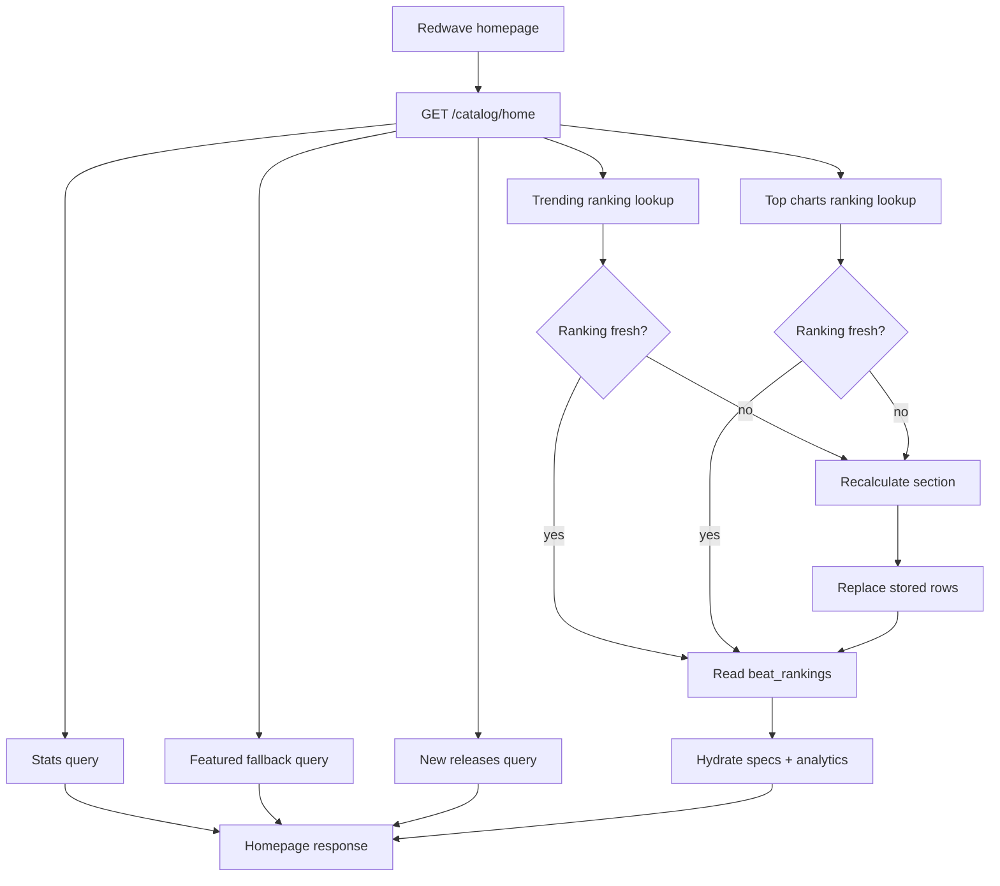
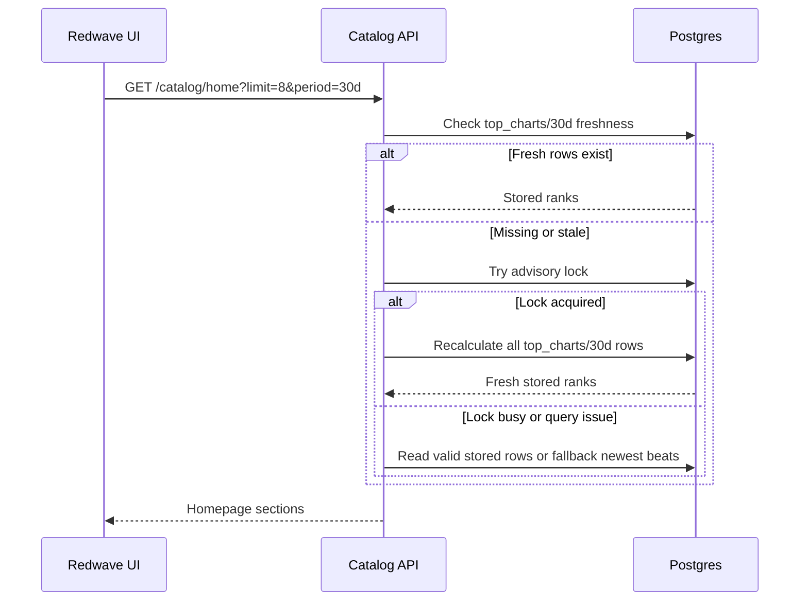

# Homepage Ranking Algorithms

This document explains how `GET /catalog/home` builds the Redwave homepage sections, how rankings are calculated, and when stored rankings refresh.

## Overview

The homepage API returns several sections in one response:

- `featured`: handpicked later; currently falls back to newest completed beats.
- `new_releases`: newest completed beats.
- `trending`: fast-moving 24-hour activity.
- `top_charts`: stable rolling chart, currently defaulted to 30 days.
- `stats`: lightweight catalog counts.

The endpoint is designed to avoid expensive ranking work on every request. It stores calculated rankings in Postgres and refreshes them only when stale.



## Storage

Rankings are stored in `beat_rankings`.

Important columns:

- `section`: `trending` or `top_charts`.
- `period`: `24h`, `7d`, or `30d`.
- `spec_id`: ranked beat.
- `rank`: final position.
- `score`: numeric score used for sorting.
- `previous_rank`: prior rank from the last stored calculation.
- `metrics`: JSON summary used by API consumers.
- `calculated_at`: refresh timestamp.

Each refresh recalculates the whole section and period, then replaces the old rows for that section/period.

Example:

```text
top_charts + 30d refresh
```

replaces all rows for:

```sql
section = 'top_charts'
period = '30d'
```

It does not update one beat at a time.

## Eligibility

Both `trending` and `top_charts` include only beats that match:

```sql
category = 'beat'
processing_status = 'completed'
is_deleted = false
```

This keeps drafts, samples, failed uploads, and deleted beats off public homepage ranking surfaces.

## Refresh Timing

Rankings are refreshed lazily when the homepage API is called.

Current freshness windows:

| Section | Period | Stale After | Reason |
| --- | --- | ---: | --- |
| `trending` | `24h` | 15 minutes | Should move quickly. |
| `top_charts` | `7d` / `30d` | 1 hour | Should be stable. |
| `featured` | n/a | live query | Curated later; newest fallback today. |
| `new_releases` | n/a | live query | Should show new completed beats quickly. |

When rows are stale or missing:

1. The backend tries to acquire a Postgres advisory lock.
2. If the lock is acquired, the section is recalculated.
3. If another worker has the lock, the endpoint avoids duplicate recalculation.
4. If ranking rows cannot be read, the homepage falls back to newest completed beats for that section.



## Trending

Trending answers:

> What is getting heat right now?

It is intentionally fast-moving and uses a 24-hour window.

Inputs:

- Plays in the last 24 hours.
- Unique logged-in listeners in the last 24 hours.
- Favorites in the last 24 hours.
- Free downloads in the last 24 hours.
- Paid orders in the last 24 hours.
- Revenue in the last 24 hours.
- Acceleration compared with the previous 24-hour window.
- Freshness bonus for recently uploaded beats.
- Small age penalty for older beats.

Formula:

```text
trending_score =
  plays_24h * 1.0
+ unique_listeners_24h * 1.5
+ favorites_24h * 4.0
+ downloads_24h * 6.0
+ paid_orders_24h * 15.0
+ revenue_24h_major * 0.15
+ acceleration_bonus
+ freshness_bonus
- age_penalty
```

Acceleration bonus:

```text
max(current_24h_activity_score - previous_24h_activity_score, 0) * 0.35
```

Freshness bonus:

- Applies to beats created in the last 7 days.
- Starts near `10`.
- Decays toward `0` as the beat approaches 7 days old.

Age penalty:

- Starts after 30 days.
- Keeps older beats from dominating trending unless they are still getting fresh activity.

## Top Charts

Top charts answers:

> What are the strongest beats in the current chart window?

It should be more stable than trending, but not all-time permanent. The homepage should use `30d` by default.

Top charts uses:

- Recent period activity as the primary score.
- Small lifetime authority as a secondary boost.
- Revenue and purchases as strong quality signals.
- A reduced lifetime boost when there is little or no recent activity.

Recent score:

```text
recent_score =
  plays_period * 1.0
+ favorites_period * 3.0
+ downloads_period * 4.0
+ paid_orders_period * 20.0
+ revenue_period_major * 0.25
```

Lifetime authority score:

```text
lifetime_authority_score =
  lifetime_plays * 0.20
+ lifetime_favorites * 1.00
+ lifetime_downloads * 1.50
+ lifetime_purchases * 6.00
```

Final score:

```text
top_chart_score =
  recent_score
+ lifetime_authority_score * authority_multiplier
```

Authority multiplier:

| Recent Score | Lifetime Authority Multiplier |
| ---: | ---: |
| `>= 5` | `0.22` |
| `> 0 and < 5` | `0.12` |
| `0` | `0.03` |

This means:

- A classic beat with strong lifetime numbers gets help.
- A beat with no current activity cannot sit at the top forever just because it is old.
- A currently active beat can outrank older catalog leaders.

Tie-break order:

1. Score.
2. Revenue.
3. Purchases.
4. Lifetime plays.
5. Recent plays.
6. Newer beat.
7. Spec ID for deterministic ordering.

## Movement

`movement` compares the new rank to the previous stored rank:

- `up`: current rank number is smaller than previous rank.
- `down`: current rank number is larger than previous rank.
- `-`: unchanged or no previous rank.

Movement becomes meaningful after at least two calculations for the same section/period.

## Algorithm Versions

Top chart rows include `metrics.algorithm_version`.

Current top chart algorithm:

```text
algorithm_version = 3
```

The homepage read path only accepts current-version top chart rows. This prevents old stored rankings from leaking into the response after the algorithm changes.

If a ranking needs to be force-rebuilt manually:

```sql
DELETE FROM beat_rankings
WHERE section = 'top_charts'
  AND period = '30d';
```

Then request:

```text
GET /catalog/home?limit=8&period=30d
```

## Local Example

Suppose local data has:

| Beat | Recent 30d Plays | Lifetime Plays |
| --- | ---: | ---: |
| Achilles Heel | 9 | 10 |
| Talk to me | 3 | 76 |
| Back Stage | 2 | 71 |

In pure lifetime ranking, `Talk to me` could stay above newer active beats for a very long time.

In pure recent ranking, `Achilles Heel` dominates and older proven beats may disappear.

With the current formula:

- `Achilles Heel` is rewarded for active recent plays.
- `Talk to me` receives an authority boost because it has a stronger historical record.
- If `Talk to me` stops receiving recent activity, its lifetime boost becomes much smaller.

This creates a chart that changes, but does not thrash.

## Future Improvements

Useful future upgrades:

- Add anonymous `session_id` to `analytics_events.meta` so unique listeners includes logged-out visitors.
- Add `published_at` and use it instead of `created_at`.
- Add admin-curated `home_featured_slots`.
- Add chart tabs in the UI: `Trending`, `Top this week`, `Top this month`, `All-time`.
- Add `score_breakdown` in API responses for observability.
- Move lazy recalculation into a scheduled worker if traffic grows.
