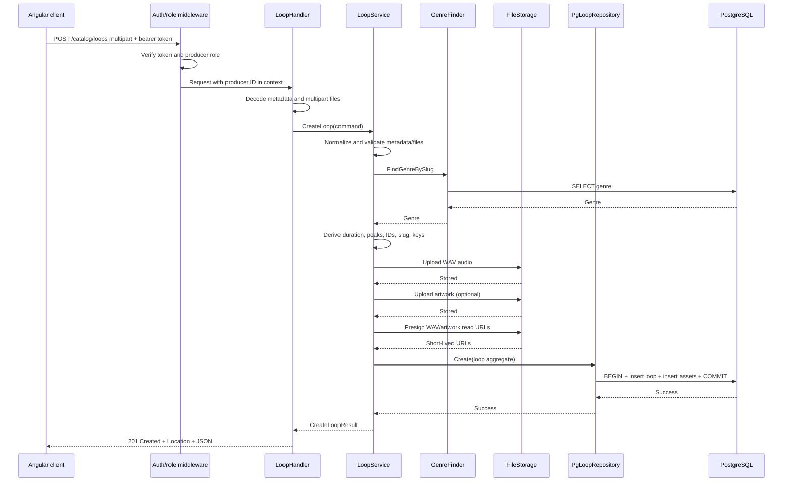

# Single-loop upload API: implementation guide

This guide designs the first backend slice for the new loop catalog:

```text
POST /catalog/loops
```

It deliberately describes what to build, where each piece belongs, and why the
pieces are built in that order. It does not implement the endpoint.

The target is the existing Go backend in `blueprint-backend`. The design follows
its current module boundaries:

```text
gateway -> HTTP interface -> application service -> domain ports
                                            |
                                            +-> PostgreSQL adapter
                                            +-> file-storage adapter
```

## 1. The decision to make before writing anything

### Put loops inside the existing `catalog` module

A loop is a catalog product. It belongs beside beats/specs and future sample
packs under:

```text
internal/modules/catalog
```

Do not create a new top-level `loops` module yet. A top-level module is useful
when a capability has its own independent lifecycle and is consumed by several
other modules. At this stage, loops are part of catalog discovery, pricing,
storage, and producer inventory.

### Do not reuse `domain.Spec` for a loop

`domain.Spec` is currently shaped around beats:

- a beat can require WAV and stems;
- a beat owns several license options;
- its validation requires beat genres, BPM, key, and licenses;
- it uses `base_price float64`;
- `CategorySample` does not distinguish a single loop from a sample pack;
- its persistence schema has beat-specific columns and analytics relations.

Adding enough flags to make `Spec` represent a beat, a loop, and a sample pack
would create one weak aggregate with many conditionally valid fields. Instead,
create a separate `Loop` aggregate in the same catalog bounded context.

This gives us:

- one model with loop-specific invariants;
- a repository with simple SQL;
- no conditional stems/license behavior;
- integer minor-unit prices matching the frontend contract;
- a clean base for a later `SamplePack` aggregate.

## 2. Version-one scope

The first vertical slice should be intentionally small and synchronous.

The producer supplies:

- JSON metadata;
- one small WAV file;
- an optional square JPEG/PNG artwork file.

The backend:

1. authenticates a producer;
2. validates metadata and the actual file contents;
3. derives duration and waveform data from the WAV rather than trusting the client;
4. uploads the assets through the existing file-storage module;
5. inserts the loop and asset rows in one PostgreSQL transaction;
6. compensates by deleting uploaded objects if the database write fails;
7. returns `201 Created`.

### Why synchronous for the first API?

A single loop is much smaller than a beat with stems. A synchronous first slice
is easier to make correct and test. It also avoids copying the current
`SpecHandler.Create` pattern, where a detached goroutine performs important
work after the response. A process restart can permanently lose that goroutine.

When upload volume or processing cost grows, evolve this flow to:

1. create an upload session;
2. upload directly to object storage with presigned URLs;
3. enqueue a durable processing job;
4. complete/publish the loop from a worker.

That is a later design. Do not build an in-memory goroutine queue as an
intermediate solution.

## 3. API contract

### Route

```http
POST /catalog/loops
Authorization: Bearer <access-token>
Content-Type: multipart/form-data
```

Register this as a new catalog route rather than `POST /specs`:

```text
POST /catalog/loops
```

The resource name matches the frontend's planned catalog surface and prevents
the old generic `spec` vocabulary from leaking into the new API.

### Multipart fields

| Part | Type | Required | Purpose |
|---|---|---:|---|
| `metadata` | JSON string | yes | User-editable loop metadata |
| `audio` | WAV file | yes | The loop file used for playback and eventual download |
| `artwork` | JPEG/PNG file | no | Custom cover; UI palette is used when absent |

There is no `preview` multipart field and the producer does not upload an MP3.
The backend derives duration and waveform peaks from `audio`. For this first
slice, the WAV's read URL is returned as `preview_url`, so the Angular player
can use the existing frontend contract without a second stored audio object.

### Important paid-loop tradeoff

If the returned WAV URL is readable by a browser, a determined user can save
the same bytes. Keep the object private and issue a short-lived signed URL, but
understand that this limits exposure rather than making the preview
undownloadable.

Before enabling serious paid-loop sales, generate a tagged, shortened, or
lower-quality derivative from the uploaded WAV. The producer still uploads
only WAV; derivative generation is a backend processing concern. It is outside
this first synchronous slice.

### Metadata request

```json
{
  "title": "Broken Radio Loop",
  "title_accent": "Radio",
  "loop_type": "melody",
  "genre_slug": "trap",
  "bpm": 78,
  "musical_key": "D major",
  "moods": ["dark", "cinematic"],
  "price": {
    "amount_minor": 349,
    "currency": "USD"
  },
  "artwork_palette": "cobalt"
}
```

The client must not send:

- `id`;
- `producer_id`;
- `slug`;
- storage keys or URLs;
- file formats;
- duration;
- waveform peaks;
- status;
- analytics counts;
- publication timestamps.

Those values are identities, derived data, or server-owned state.

### Successful response

Use `201 Created`, set:

```http
Location: /catalog/loops/{slug}
```

and return:

```json
{
  "data": {
    "id": "019...",
    "slug": "broken-radio-loop-a31f9c",
    "title": "Broken Radio Loop",
    "title_accent": "Radio",
    "loop_type": "melody",
    "genre": "trap",
    "bpm": 78,
    "musical_key": "D major",
    "moods": ["dark", "cinematic"],
    "formats": ["wav"],
    "duration_seconds": 18,
    "price": {
      "amount_minor": 349,
      "currency": "USD"
    },
    "artwork": {
      "image_url": "short-lived-or-public-url",
      "alt": "Broken Radio Loop artwork",
      "palette": "cobalt"
    },
    "preview_url": "short-lived-signed-url-for-the-wav",
    "waveform_peaks": [18, 31, 44, 62],
    "status": "published",
    "published_at": "2026-07-23T10:30:00Z"
  }
}
```

The response is close to `LoopCatalogItemDto` in the Angular app. Producer
summary and engagement counts can be added by the list/read APIs. They are not
required to prove that upload creation works.

### Error status contract

| Status | When |
|---:|---|
| `400` | Malformed JSON, invalid metadata, missing required multipart part |
| `401` | No valid access token |
| `403` | Authenticated user is not a producer |
| `409` | Slug/storage uniqueness conflict that cannot be retried |
| `413` | Request or individual file exceeds its size limit |
| `415` | File bytes do not match an accepted media format |
| `422` | Structurally valid request violates a domain rule |
| `500` | Storage, database, ID generation, or other internal failure |

Use `internal/shared/utils.WriteJSON` and `WriteError`. Log the full internal
error server-side. Do not expose database/storage details through the response's
`details` field.

## 4. Target file layout

Create or update the following files:

```text
db/migrations/
  000036_create_loops.up.sql
  000036_create_loops.down.sql

internal/modules/catalog/
  domain/
    loop.go
    loop_repository.go
    errors.go                         # add loop sentinel errors

  application/
    dto/
      create_loop.go
    loop_ports.go
    loop_service.go
    loop_validation.go
    loop_media.go

  infrastructure/persistence/postgres/
    loop_repo.go
    loop_repo_test.go

  interfaces/http/
    loop_dto.go
    loop_handler.go
    loop_handler_test.go

  module.go                          # wire loop repository/service/handler

internal/gateway/
  middleware/
    auth.go                          # reusable producer-role guard
  routes.go                          # register POST /catalog/loops
  routes_test.go

cmd/server/
  main.go                            # pass LoopHandler into RouterConfig
```

Keep loop files separate from `spec.go`, `service.go`, `spec_repo.go`, and
`handler.go`. Separation by aggregate is more useful than growing those already
large files.

### The five different models and why all five exist

Do not try to use one struct everywhere.

| Model | File | Knows about | Must not know about |
|---|---|---|---|
| HTTP request DTO | `interfaces/http/loop_dto.go` | JSON field names | SQL/storage behavior |
| Application command/result | `application/dto/create_loop.go` | Use-case inputs and file streams | HTTP writer, SQL columns |
| Domain model | `domain/loop.go` | Loop identity and business state | Multipart, `sqlx`, `lib/pq` |
| DB row model | `infrastructure/persistence/postgres/loop_repo.go` | `db` tags, nullable SQL values, PostgreSQL arrays | HTTP JSON |
| HTTP response DTO | `interfaces/http/loop_dto.go` | Public JSON contract and read URLs | Storage keys, DB-only fields |

The transformation path is:

```text
CreateLoopMetadataRequest + multipart.File
                    |
                    v
          CreateLoopCommand
                    |
                    v
              domain.Loop
                    |
                    v
       loopRow + loopAssetRow

CreateLoopResult -> CreateLoopResponse
```

## 5. Domain layer

Start here because the domain layer establishes the language and invariants
used by every outer layer. It must not import `net/http`, `multipart`, `sqlx`,
PostgreSQL, S3, or Redis.

### `domain/loop.go`

Define the following named types:

```go
type LoopType string

const (
    LoopTypeMelody LoopType = "melody"
    LoopTypeDrums  LoopType = "drums"
    LoopTypeBass   LoopType = "bass"
    LoopTypeFX     LoopType = "fx"
    LoopTypeVocal  LoopType = "vocal"
    LoopTypeFull   LoopType = "full"
)

type LoopStatus string

const (
    LoopStatusProcessing LoopStatus = "processing"
    LoopStatusPublished  LoopStatus = "published"
    LoopStatusFailed     LoopStatus = "failed"
    LoopStatusArchived   LoopStatus = "archived"
)

type LoopAssetKind string

const (
    LoopAssetAudio   LoopAssetKind = "audio"
    LoopAssetArtwork LoopAssetKind = "artwork"
)

type LoopAudioFormat string

const (
    LoopFormatWAV LoopAudioFormat = "wav"
)
```

Use named strings so invalid values cannot silently spread throughout the
service and repository.

The aggregate should have this shape:

```go
type Loop struct {
    ID               uuid.UUID
    ProducerID       uuid.UUID
    GenreID          uuid.UUID
    GenreSlug        string
    Slug             string
    Title            string
    TitleAccent      *string
    LoopType         LoopType
    BPM              int
    MusicalKey       *string
    Moods            []string
    PriceAmountMinor int64
    PriceCurrency    string
    ArtworkPalette   string
    DurationSeconds  int
    WaveformPeaks    []int64
    Status           LoopStatus
    PublishedAt      *time.Time
    CreatedAt        time.Time
    UpdatedAt        time.Time
    DeletedAt        *time.Time
    Assets           []LoopAsset
}
```

Use plain Go slices in the domain. Do not import `lib/pq` here. The PostgreSQL
repository may use `pq.StringArray`/`pq.Int64Array` in private persistence row
types and map those values to the pure domain model.

And each stored object should be represented as:

```go
type LoopAsset struct {
    ID               uuid.UUID
    LoopID           uuid.UUID
    Kind             LoopAssetKind
    StorageKey       string
    OriginalFilename string
    ContentType      string
    Format           string
    SizeBytes        int64
    CreatedAt        time.Time
}
```

### Why store storage keys instead of URLs?

The key is stable:

```text
catalog/loops/{producer-id}/{loop-id}/audio.wav
```

A URL can change when:

- the S3 bucket changes;
- a CDN is introduced;
- local storage is replaced;
- private objects require a new signature.

Persist keys and create public/presigned URLs at the transport/read boundary.
The existing file-storage service already accepts explicit keys and can create
presigned URLs.

### `domain/loop_repository.go`

Define the minimum ports needed by this slice:

```go
type LoopRepository interface {
    Create(ctx context.Context, loop *Loop) error
}

type GenreFinder interface {
    FindGenreBySlug(ctx context.Context, slug string) (*Genre, error)
}
```

These interfaces belong in the domain because the application depends on the
capabilities, while PostgreSQL is only one implementation.

Do not add future list, update, wishlist, cart, or delete methods yet. Add a
method when a use case needs it.

### `domain/errors.go`

Add sentinel errors:

```go
ErrLoopNotFound
ErrLoopSlugConflict
ErrGenreNotFound
ErrInvalidLoop
ErrInvalidLoopAsset
ErrLoopUploadFailed
```

Sentinel errors let the handler use `errors.Is` instead of parsing error
strings. Infrastructure errors should be wrapped with `%w`.

## 6. Database migration

Write the migration after the aggregate fields are agreed. This keeps the SQL
schema aligned with the domain instead of allowing database columns to dictate
the model accidentally.

### `000036_create_loops.up.sql`

The intended schema is:

```sql
CREATE TABLE loops (
    id UUID PRIMARY KEY,
    producer_id UUID NOT NULL
        CONSTRAINT fk_loops_producer REFERENCES users(id) ON DELETE RESTRICT,
    genre_id UUID NOT NULL
        CONSTRAINT fk_loops_genre REFERENCES genres(id) ON DELETE RESTRICT,

    slug VARCHAR(160) NOT NULL CONSTRAINT uq_loops_slug UNIQUE,
    title VARCHAR(100) NOT NULL,
    title_accent VARCHAR(40),
    loop_type VARCHAR(20) NOT NULL
        CHECK (loop_type IN ('melody', 'drums', 'bass', 'fx', 'vocal', 'full')),

    bpm INTEGER NOT NULL CHECK (bpm BETWEEN 60 AND 300),
    musical_key VARCHAR(20),
    moods TEXT[] NOT NULL DEFAULT '{}',

    price_amount_minor BIGINT NOT NULL CHECK (price_amount_minor >= 0),
    price_currency VARCHAR(3) NOT NULL
        CHECK (price_currency IN ('INR', 'USD')),

    artwork_palette VARCHAR(20) NOT NULL DEFAULT 'hot'
        CHECK (artwork_palette IN ('hot', 'cobalt', 'lime', 'lavender', 'sun', 'midnight')),
    duration_seconds INTEGER NOT NULL CHECK (duration_seconds BETWEEN 1 AND 180),
    waveform_peaks SMALLINT[] NOT NULL DEFAULT '{}',

    status VARCHAR(20) NOT NULL DEFAULT 'processing'
        CHECK (status IN ('processing', 'published', 'failed', 'archived')),
    published_at TIMESTAMPTZ,
    created_at TIMESTAMPTZ NOT NULL,
    updated_at TIMESTAMPTZ NOT NULL,
    deleted_at TIMESTAMPTZ
);

CREATE TABLE loop_assets (
    id UUID PRIMARY KEY,
    loop_id UUID NOT NULL
        CONSTRAINT fk_loop_assets_loop REFERENCES loops(id) ON DELETE CASCADE,
    kind VARCHAR(20) NOT NULL
        CHECK (kind IN ('audio', 'artwork')),
    storage_key VARCHAR(500) NOT NULL
        CONSTRAINT uq_loop_assets_storage_key UNIQUE,
    original_filename VARCHAR(255) NOT NULL,
    content_type VARCHAR(100) NOT NULL,
    format VARCHAR(20) NOT NULL,
    size_bytes BIGINT NOT NULL CHECK (size_bytes > 0),
    created_at TIMESTAMPTZ NOT NULL,
    CONSTRAINT uq_loop_assets_kind UNIQUE (loop_id, kind),
    CONSTRAINT ck_loop_assets_kind_format CHECK (
        (kind = 'audio' AND format = 'wav')
        OR
        (kind = 'artwork' AND format IN ('jpeg', 'png'))
    )
);

CREATE INDEX idx_loops_published
    ON loops (published_at DESC)
    WHERE status = 'published' AND deleted_at IS NULL;

CREATE INDEX idx_loops_producer
    ON loops (producer_id, created_at DESC)
    WHERE deleted_at IS NULL;

CREATE INDEX idx_loops_genre
    ON loops (genre_id)
    WHERE status = 'published' AND deleted_at IS NULL;

CREATE INDEX idx_loops_type_bpm
    ON loops (loop_type, bpm)
    WHERE status = 'published' AND deleted_at IS NULL;

CREATE INDEX idx_loops_moods_gin
    ON loops USING GIN (moods);
```

### Why two tables?

`loops` is the product aggregate root. `loop_assets` contains replaceable file
metadata. This avoids columns such as `wav_url`, `midi_url`, and `artwork_url`
accumulating on the product table.

The asset table can later add `midi` without changing the main loop row.

### Why integer minor-unit pricing?

Store `349`, not `3.49`:

```text
349 USD minor units = $3.49
```

Integer money avoids floating-point rounding and matches the Angular
`CatalogMoneyDto`.

### Down migration

`000036_create_loops.down.sql` should only reverse this migration:

```sql
DROP TABLE IF EXISTS loop_assets;
DROP TABLE IF EXISTS loops;
```

The child table must be dropped first because it references `loops`.

## 7. Application DTO

### `application/dto/create_loop.go`

The application command is not the HTTP request DTO. It contains already
decoded values and transport-neutral file streams.

Use a file input similar to:

```go
type UploadInput struct {
    Reader      io.ReadSeeker
    Filename    string
    SizeBytes   int64
    ContentType string
}
```

`io.ReadSeeker` is deliberate. Validation reads the header, waveform extraction
reads the content, and upload reads it again. Each stage must rewind to offset
zero.

The command should be:

```go
type CreateLoopCommand struct {
    ProducerID     uuid.UUID
    Title          string
    TitleAccent    *string
    LoopType       domain.LoopType
    GenreSlug      string
    BPM            int
    MusicalKey     *string
    Moods          []string
    PriceAmountMinor int64
    PriceCurrency  string
    ArtworkPalette string

    Audio   UploadInput
    Artwork *UploadInput
}

type CreateLoopResult struct {
    Loop       *domain.Loop
    AudioURL   string
    ArtworkURL *string
}
```

The producer ID is injected from authenticated context. It is never decoded
from metadata.

## 8. Application ports

### `application/loop_ports.go`

The loop service needs three file-storage operations:

```go
type LoopAssetStore interface {
    UploadWithKey(
        ctx context.Context,
        file io.Reader,
        key string,
        contentType string,
    ) (string, error)

    Delete(ctx context.Context, key string) error

    GetPresignedURL(
        ctx context.Context,
        key string,
        expiration time.Duration,
    ) (string, error)
}
```

The existing `filestorage/application.FileService` already satisfies this
shape. The loop service depends on this narrow interface, not the concrete S3
or local implementation.

The interface belongs in the application package because the application use
case owns the need to store and compensate assets. It should not live in
`interfaces/http`; storage is not an HTTP concern.

## 9. Validation and media inspection

### `application/loop_validation.go`

Keep metadata validation separate from orchestration.

Validate and normalize:

| Field | Rule |
|---|---|
| `title` | Trimmed, 1–100 Unicode characters |
| `title_accent` | Optional, at most 40 characters; preferably occurs inside title |
| `loop_type` | One of the six domain constants |
| `genre_slug` | Lowercase slug; must resolve through `GenreFinder` |
| `bpm` | 60–300 |
| `musical_key` | Optional; if present, one of the supported major/minor keys |
| `moods` | Maximum 5, unique, normalized lowercase values |
| `amount_minor` | `>= 0` |
| `currency` | Uppercase `INR` or `USD` |
| `artwork_palette` | One of the frontend palette values; default `hot` |

Reuse validation vocabulary where sensible, but do not call `validateSpec`.
That function contains beat/category/license rules that do not belong to a
loop.

### `application/loop_media.go`

Validate bytes, not only filenames or browser-provided MIME headers.

Recommended limits:

| Asset | Limit | Validation |
|---|---:|---|
| WAV audio | 100 MiB | `RIFF` and `WAVE` header, decodable PCM chunks |
| Artwork | 5 MiB | JPEG/PNG decode succeeds, square dimensions |
| Total request | 110 MiB | Applied with `http.MaxBytesReader` |

Derive:

- duration from the WAV `fmt ` and `data` chunks;
- 64 waveform bars from WAV PCM samples;
- WAV format from the actual bytes;
- asset size from `multipart.FileHeader.Size`.

Do not accept duration, format, or peaks from the client.

The existing `application.ExtractWaveformPeaks` is MP3-specific and must not be
called for this endpoint. Add a WAV-specific inspector, for example:

```go
type WAVInfo struct {
    Channels        int
    SampleRate      int
    BitsPerSample   int
    DurationSeconds int
    WaveformPeaks   []int64
}

func InspectWAV(source io.ReadSeeker, barCount int) (WAVInfo, error)
```

For the first version, support uncompressed PCM WAV, mono or stereo, with
16-bit or 24-bit samples. Reject compressed WAV codecs. Parse chunks by their
IDs rather than assuming that `fmt ` and `data` occur at fixed byte offsets.

The WAV inspector should follow this exact algorithm:

1. Read the first 12 bytes.
2. Require bytes `0..3` to be `RIFF`.
3. Require bytes `8..11` to be `WAVE`.
4. Repeatedly read an 8-byte chunk header:
   - four-byte chunk ID;
   - little-endian `uint32` chunk size.
5. For the `fmt ` chunk, read:
   - audio format;
   - channel count;
   - sample rate;
   - byte rate;
   - block alignment;
   - bits per sample.
6. Require audio format `1` for PCM.
7. Require one or two channels.
8. Require 16-bit or 24-bit samples for version one.
9. For the `data` chunk, record its offset and byte length.
10. Skip unknown chunks. If a chunk size is odd, also skip its RIFF padding
    byte.
11. Require both `fmt ` and `data` before accepting the file.
12. Calculate:

    ```text
    totalFrames = dataSize / blockAlign
    durationSeconds = ceil(dataSize / byteRate)
    ```

13. Require duration between 1 and 180 seconds.
14. Divide `totalFrames` into 64 buckets.
15. Decode each sample to a signed amplitude:
    - 16-bit: little-endian signed integer;
    - 24-bit: assemble three bytes and sign-extend.
16. For stereo, combine left/right absolute amplitudes per frame.
17. Keep an average or peak amplitude for each bucket.
18. Normalize the 64 bucket values to the range `0..100`.
19. Rewind the stream to byte zero before returning.

Unit-test files containing `JUNK`, `LIST`, or other metadata chunks. Real WAV
files frequently contain these chunks, so a parser that assumes `data` begins
at byte 44 will eventually reject valid producer uploads.

Validation order matters:

1. metadata first;
2. declared size;
3. magic bytes/decode;
4. duration;
5. waveform.

Cheap failures should happen before storage uploads.

## 10. Application service

### `application/loop_service.go`

Define:

```go
type LoopService interface {
    CreateLoop(
        ctx context.Context,
        command dto.CreateLoopCommand,
    ) (*dto.CreateLoopResult, error)
}
```

The concrete service should depend on:

```go
type loopService struct {
    loops  domain.LoopRepository
    genres domain.GenreFinder
    assets LoopAssetStore
}
```

### Exact orchestration order

`CreateLoop` should perform the following steps:

1. **Normalize and validate metadata.**
   - Fails before any I/O side effect.

2. **Resolve `genre_slug` to a genre ID.**
   - The API accepts a stable human-readable slug.
   - The database stores the foreign key.

3. **Validate all supplied files.**
   - Verify size and bytes.
   - Rewind every stream after reading.

4. **Derive duration and waveform peaks.**
   - These are authoritative server values.

5. **Generate IDs before uploading.**
   - Generate UUIDv7 for the loop and every asset.
   - The loop ID becomes part of deterministic storage keys.

6. **Generate a slug.**
   - Start with a normalized title.
   - Append a short random/UUID segment, for example
     `broken-radio-loop-a31f9c`.
   - The database unique constraint remains authoritative.

7. **Build storage keys.**

   ```text
   catalog/loops/{producer-id}/{loop-id}/audio.wav
   catalog/loops/{producer-id}/{loop-id}/artwork.jpg
   ```

8. **Upload assets.**
   - Upload one at a time for the first version.
   - Record every successfully uploaded key in a cleanup stack.
   - Rewind the stream immediately before upload.

9. **Generate short-lived read URLs.**
   - Call `GetPresignedURL` for the uploaded WAV and optional artwork.
   - A one-hour expiry is sufficient for the immediate response.
   - If signing fails, compensate the uploaded objects and do not insert the
     database row.

10. **Build the complete domain aggregate.**
   - Set status to `published`.
   - Set `published_at`, `created_at`, and `updated_at` from one UTC time.
   - Attach all `LoopAsset` values.

11. **Call `LoopRepository.Create`.**
    - The repository atomically writes the loop and asset metadata.

12. **Compensate on failure.**
    - If any upload or database operation fails, delete all keys already
      uploaded.
    - Log cleanup failures without replacing the original error.

13. **Return a `CreateLoopResult`.**
    - It contains the created aggregate plus the immediate WAV/artwork URLs
      returned by file storage.
    - Only storage keys are persisted.

### Exact aggregate construction

After validation, upload, and derivation, the service constructs:

```go
createdAt := time.Now().UTC()
publishedAt := createdAt

loop := &domain.Loop{
    ID:               loopID,
    ProducerID:       command.ProducerID,
    GenreID:          genre.ID,
    GenreSlug:        genre.Slug,
    Slug:             generatedSlug,
    Title:            normalizedTitle,
    TitleAccent:      normalizedTitleAccent,
    LoopType:         command.LoopType,
    BPM:              command.BPM,
    MusicalKey:       normalizedMusicalKey,
    Moods:            normalizedMoods,
    PriceAmountMinor: command.PriceAmountMinor,
    PriceCurrency:    normalizedCurrency,
    ArtworkPalette:   normalizedPalette,
    DurationSeconds:  wavInfo.DurationSeconds,
    WaveformPeaks:    wavInfo.WaveformPeaks,
    Status:           domain.LoopStatusPublished,
    PublishedAt:      &publishedAt,
    CreatedAt:        createdAt,
    UpdatedAt:        createdAt,
    Assets: []domain.LoopAsset{
        {
            ID:               audioAssetID,
            LoopID:           loopID,
            Kind:             domain.LoopAssetAudio,
            StorageKey:       audioKey,
            OriginalFilename: safeOriginalFilename,
            ContentType:      "audio/wav",
            Format:           "wav",
            SizeBytes:        command.Audio.SizeBytes,
            CreatedAt:        createdAt,
        },
    },
}
```

When artwork exists, append one `LoopAssetArtwork` with the canonical content
type and format found by image decoding. Do not persist the browser-supplied
`Content-Type` as authoritative.

Return:

```go
result := &dto.CreateLoopResult{
    Loop:       loop,
    AudioURL:   signedAudioURL,
    ArtworkURL: signedArtworkURL,
}
```

### Why storage upload occurs before the SQL transaction

PostgreSQL cannot roll back S3/local filesystem writes. Also, an SQL transaction
must not stay open during slow network uploads.

The safe first-version pattern is:

```text
validate -> upload objects -> short DB transaction
                           -> delete objects if DB fails
```

This is a compensating transaction. It is not perfectly atomic, but it is
observable, testable, and does not hold database locks during upload.

### Notifications

After the repository commits, a success notification may be sent as a
best-effort side effect. Notification failure must not turn a successfully
created loop into an HTTP failure.

For stricter delivery later, add an outbox row inside the same SQL transaction.

## 11. PostgreSQL repository

### `infrastructure/persistence/postgres/loop_repo.go`

Create:

```go
type PgLoopRepository struct {
    db *sqlx.DB
}

func NewLoopRepository(db *sqlx.DB) *PgLoopRepository
```

The concrete type should implement both:

```go
domain.LoopRepository
domain.GenreFinder
```

### Exact DB row models

The DB models are private to the PostgreSQL package. They are not domain
entities and they are never encoded as JSON.

```go
type loopRow struct {
    ID               uuid.UUID      `db:"id"`
    ProducerID       uuid.UUID      `db:"producer_id"`
    GenreID          uuid.UUID      `db:"genre_id"`
    Slug             string         `db:"slug"`
    Title            string         `db:"title"`
    TitleAccent      *string        `db:"title_accent"`
    LoopType         string         `db:"loop_type"`
    BPM              int            `db:"bpm"`
    MusicalKey       *string        `db:"musical_key"`
    Moods            pq.StringArray `db:"moods"`
    PriceAmountMinor int64          `db:"price_amount_minor"`
    PriceCurrency    string         `db:"price_currency"`
    ArtworkPalette   string         `db:"artwork_palette"`
    DurationSeconds  int            `db:"duration_seconds"`
    WaveformPeaks    pq.Int64Array  `db:"waveform_peaks"`
    Status           string         `db:"status"`
    PublishedAt      *time.Time     `db:"published_at"`
    CreatedAt        time.Time      `db:"created_at"`
    UpdatedAt        time.Time      `db:"updated_at"`
    DeletedAt        *time.Time     `db:"deleted_at"`
}

type loopAssetRow struct {
    ID               uuid.UUID `db:"id"`
    LoopID           uuid.UUID `db:"loop_id"`
    Kind             string    `db:"kind"`
    StorageKey       string    `db:"storage_key"`
    OriginalFilename string    `db:"original_filename"`
    ContentType      string    `db:"content_type"`
    Format           string    `db:"format"`
    SizeBytes        int64     `db:"size_bytes"`
    CreatedAt        time.Time `db:"created_at"`
}

type genreRow struct {
    ID        uuid.UUID `db:"id"`
    Name      string    `db:"name"`
    Slug      string    `db:"slug"`
    CreatedAt time.Time `db:"created_at"`
}
```

Add explicit mapper functions in the same package:

```go
func toLoopRow(loop *domain.Loop) loopRow
func toLoopAssetRow(asset domain.LoopAsset) loopAssetRow
func toDomainGenre(row genreRow) *domain.Genre
```

The mapper is where plain domain slices become PostgreSQL driver arrays:

```text
[]string -> pq.StringArray
[]int64  -> pq.Int64Array
```

This keeps the domain package independent from `lib/pq`.

### Exact SQL constants

Place these near the top of `loop_repo.go`:

```go
const findGenreBySlugQuery = `
    SELECT id, name, slug, created_at
    FROM genres
    WHERE slug = $1
`

const insertLoopQuery = `
    INSERT INTO loops (
        id,
        producer_id,
        genre_id,
        slug,
        title,
        title_accent,
        loop_type,
        bpm,
        musical_key,
        moods,
        price_amount_minor,
        price_currency,
        artwork_palette,
        duration_seconds,
        waveform_peaks,
        status,
        published_at,
        created_at,
        updated_at,
        deleted_at
    ) VALUES (
        :id,
        :producer_id,
        :genre_id,
        :slug,
        :title,
        :title_accent,
        :loop_type,
        :bpm,
        :musical_key,
        :moods,
        :price_amount_minor,
        :price_currency,
        :artwork_palette,
        :duration_seconds,
        :waveform_peaks,
        :status,
        :published_at,
        :created_at,
        :updated_at,
        :deleted_at
    )
`

const insertLoopAssetQuery = `
    INSERT INTO loop_assets (
        id,
        loop_id,
        kind,
        storage_key,
        original_filename,
        content_type,
        format,
        size_bytes,
        created_at
    ) VALUES (
        :id,
        :loop_id,
        :kind,
        :storage_key,
        :original_filename,
        :content_type,
        :format,
        :size_bytes,
        :created_at
    )
`
```

For this API, `loop_assets` receives:

```text
one required row: kind=audio, format=wav
zero or one row: kind=artwork, format=jpeg or png
```

The repository method should have this control-flow shape:

```go
func (r *PgLoopRepository) Create(
    ctx context.Context,
    loop *domain.Loop,
) error {
    tx, err := r.db.BeginTxx(ctx, nil)
    if err != nil {
        return fmt.Errorf("begin create loop transaction: %w", err)
    }
    defer tx.Rollback()

    row := toLoopRow(loop)
    if _, err := tx.NamedExecContext(ctx, insertLoopQuery, row); err != nil {
        return mapLoopPersistenceError(err)
    }

    for _, asset := range loop.Assets {
        assetRow := toLoopAssetRow(asset)
        if _, err := tx.NamedExecContext(
            ctx,
            insertLoopAssetQuery,
            assetRow,
        ); err != nil {
            return mapLoopPersistenceError(err)
        }
    }

    if err := tx.Commit(); err != nil {
        return fmt.Errorf("commit create loop transaction: %w", err)
    }
    return nil
}
```

Before `BeginTxx`, validate that the aggregate contains exactly one
`LoopAssetAudio`. This is an aggregate consistency check, not a media-file
validation check.

### `FindGenreBySlug`

Use `db.GetContext` with `findGenreBySlugQuery`:

```sql
SELECT id, name, slug, created_at
FROM genres
WHERE slug = $1
```

Map `sql.ErrNoRows` to `domain.ErrGenreNotFound`.

Do not auto-create a genre during upload. Genres are controlled catalog
taxonomy. A typo such as `trpa` must fail rather than create a new genre.

The method shape is:

```go
func (r *PgLoopRepository) FindGenreBySlug(
    ctx context.Context,
    slug string,
) (*domain.Genre, error) {
    var row genreRow
    err := r.db.GetContext(ctx, &row, findGenreBySlugQuery, slug)
    if errors.Is(err, sql.ErrNoRows) {
        return nil, domain.ErrGenreNotFound
    }
    if err != nil {
        return nil, fmt.Errorf("find genre by slug: %w", err)
    }
    return toDomainGenre(row), nil
}
```

### `Create`

The repository method should:

1. call `BeginTxx`;
2. defer rollback;
3. map `domain.Loop` to `loopRow`;
4. call `tx.NamedExecContext(ctx, insertLoopQuery, row)`;
5. map and insert every asset using `insertLoopAssetQuery`;
6. verify there is exactly one `audio` asset before inserting;
7. commit;
8. let the deferred rollback harmlessly run after commit.

The transaction owns database atomicity only. It does not call storage,
validate media, generate URLs, or write HTTP responses.

Use `NamedExecContext` with the private `loopRow` and `loopAssetRow` values. The
domain structs intentionally do not contain `db` tags.

Map PostgreSQL errors:

| PostgreSQL condition | Domain result |
|---|---|
| unique violation `23505` on slug | `ErrLoopSlugConflict` |
| foreign-key violation `23503` | `ErrGenreNotFound` or wrapped persistence error |
| check violation `23514` | `ErrInvalidLoop` |
| all others | wrapped internal error |

Do not inspect database errors using arbitrary substring checks when the driver
exposes a PostgreSQL error code.

With the explicitly named SQL constraints above, the mapper can make stable
decisions:

```go
func mapLoopPersistenceError(err error) error {
    var pqErr *pq.Error
    if !errors.As(err, &pqErr) {
        return fmt.Errorf("persist loop: %w", err)
    }

    switch {
    case pqErr.Code == "23505" && pqErr.Constraint == "uq_loops_slug":
        return domain.ErrLoopSlugConflict
    case pqErr.Code == "23503" && pqErr.Constraint == "fk_loops_genre":
        return domain.ErrGenreNotFound
    case pqErr.Code == "23505" &&
        (pqErr.Constraint == "uq_loop_assets_storage_key" ||
            pqErr.Constraint == "uq_loop_assets_kind"):
        return domain.ErrInvalidLoopAsset
    case pqErr.Code == "23514":
        return domain.ErrInvalidLoop
    default:
        return fmt.Errorf("persist loop: %w", err)
    }
}
```

## 12. HTTP DTOs

### `interfaces/http/loop_dto.go`

Create transport-only structs:

```go
type CreateLoopMetadataRequest struct {
    Title          string                `json:"title"`
    TitleAccent    *string               `json:"title_accent"`
    LoopType       string                `json:"loop_type"`
    GenreSlug      string                `json:"genre_slug"`
    BPM            int                   `json:"bpm"`
    MusicalKey     *string               `json:"musical_key"`
    Moods          []string              `json:"moods"`
    Price          CreateLoopPriceRequest `json:"price"`
    ArtworkPalette string                `json:"artwork_palette"`
}

type CreateLoopPriceRequest struct {
    AmountMinor int64  `json:"amount_minor"`
    Currency    string `json:"currency"`
}
```

Create response structs rather than serializing `domain.Loop` directly.

Use these exact response shapes:

```go
type CreateLoopResponseEnvelope struct {
    Data CreateLoopResponse `json:"data"`
}

type CreateLoopResponse struct {
    ID              uuid.UUID           `json:"id"`
    Slug            string              `json:"slug"`
    Title           string              `json:"title"`
    TitleAccent     *string             `json:"title_accent"`
    LoopType        string              `json:"loop_type"`
    Genre           string              `json:"genre"`
    BPM             int                 `json:"bpm"`
    MusicalKey      *string             `json:"musical_key"`
    Moods           []string            `json:"moods"`
    Formats         []string            `json:"formats"`
    DurationSeconds int                 `json:"duration_seconds"`
    Price           LoopMoneyResponse   `json:"price"`
    Artwork         LoopArtworkResponse `json:"artwork"`
    PreviewURL      string              `json:"preview_url"`
    WaveformPeaks   []int64             `json:"waveform_peaks"`
    Status          string              `json:"status"`
    PublishedAt     time.Time           `json:"published_at"`
}

type LoopMoneyResponse struct {
    AmountMinor int64  `json:"amount_minor"`
    Currency    string `json:"currency"`
}

type LoopArtworkResponse struct {
    ImageURL *string `json:"image_url"`
    Alt      string  `json:"alt"`
    Palette  string  `json:"palette"`
}
```

The mapper always sets:

```text
formats = ["wav"]
preview_url = result.AudioURL
artwork.alt = loop.Title + " artwork"
```

Why:

- DB/storage fields such as `storage_key` must not leak;
- the API uses snake_case while Go/domain names remain idiomatic;
- URLs are presentation values;
- changing a domain struct should not silently change the public API.

Add a mapper:

```text
ToCreateLoopResponse(result)
```

The immediate create response maps `result.AudioURL` to `preview_url`. For later
read/list APIs, generate short-lived read URLs from the persisted storage keys.

## 13. HTTP handler

### `interfaces/http/loop_handler.go`

The handler should depend only on:

```go
type LoopHandler struct {
    service application.LoopService
}
```

Do not inject the repository, SQL database, or file-storage service into the
handler. Storage orchestration belongs to the application use case.

### Handler responsibilities

`Create` should do only transport work:

1. wrap `r.Body` with `http.MaxBytesReader`;
2. call `ParseMultipartForm` with a moderate in-memory limit, for example
   `16 << 20`;
3. defer `r.MultipartForm.RemoveAll()` so temporary files are removed;
4. decode the `metadata` part with `json.Decoder`;
5. call `DisallowUnknownFields`;
6. read authenticated user ID from context;
7. open the required `audio` part;
8. open optional `artwork`;
9. defer closing all multipart files;
10. map request values to `CreateLoopCommand`;
11. call `service.CreateLoop`;
12. map sentinel errors to status codes;
13. map `AudioURL` to response `preview_url`;
14. write `Location` and the `201` JSON response.

The handler-to-command mapping should look like this:

```go
command := dto.CreateLoopCommand{
    ProducerID:       producerID,
    Title:            request.Title,
    TitleAccent:      request.TitleAccent,
    LoopType:         domain.LoopType(request.LoopType),
    GenreSlug:        request.GenreSlug,
    BPM:              request.BPM,
    MusicalKey:       request.MusicalKey,
    Moods:            request.Moods,
    PriceAmountMinor: request.Price.AmountMinor,
    PriceCurrency:    request.Price.Currency,
    ArtworkPalette:   request.ArtworkPalette,
    Audio: dto.UploadInput{
        Reader:      audioFile,
        Filename:    audioHeader.Filename,
        SizeBytes:   audioHeader.Size,
        ContentType: audioHeader.Header.Get("Content-Type"),
    },
}
```

If artwork exists, create the same `UploadInput` shape and assign
`command.Artwork`. No file data should be copied into a `[]byte`; pass the
seekable multipart stream through the synchronous service.

The handler should not:

- validate WAV internals;
- generate IDs/slugs;
- resize artwork;
- upload files;
- call SQL;
- start goroutines;
- send notifications;
- contain pricing rules.

### Multipart cleanup

`ParseMultipartForm` spills large parts to temporary disk. Always call:

```text
r.MultipartForm.RemoveAll()
```

after the synchronous service returns. Otherwise temporary upload files remain
on disk.

## 14. Authentication and producer authorization

The existing route uses `RequireAuth`, which accepts both artists and producers.
This endpoint must enforce producer role.

Add a reusable role guard to:

```text
internal/gateway/middleware/auth.go
```

It should read `ContextKeyRole` and return:

- `401` when no authenticated role exists;
- `403` when the role is not `producer`;
- otherwise call the next handler.

Compose middleware in this order:

```text
RequireAuth(
    RequireRole("producer", LoopHandler.Create),
)
```

`RequireAuth` must execute first so it can populate context.

The handler should still defensively verify that a UUID is present in
`ContextKeyUserId`. It should never accept `producer_id` from the body.

An upload-specific rate limit is advisable, but the current in-memory,
IP-oriented limiter is not ideal for authenticated uploads. Prefer a
user-ID-based Redis limiter later. Do not block the first slice on that change.

## 15. Module wiring

### `internal/modules/catalog/module.go`

Extend `Module` with:

```text
loopRepository
loopService
loopHandler
```

`NewModule` should:

1. create `PgLoopRepository` from `db`;
2. create `LoopService` with the loop repository, genre finder, and existing
   file-storage service;
3. create `LoopHandler` with only the service;
4. expose `LoopHTTPHandler()`.

The spec repository remains passed into `NewModule` because analytics and
payment share it. The loop repository can be constructed inside the catalog
module until another module needs a loop finder.

### `internal/gateway/routes.go`

Add to `RouterConfig`:

```text
LoopHandler *catalog_http.LoopHandler
```

Register:

```text
POST /catalog/loops
```

with authentication and producer authorization.

### `cmd/server/main.go`

Pass:

```text
LoopHandler: catalogModule.LoopHTTPHandler()
```

into `gateway.RouterConfig`.

`main.go` is the composition root. It is the correct place for concrete module
wiring, but it must not contain upload behavior.

## 16. End-to-end control flow



On a storage or repository failure, the service walks its cleanup stack and
deletes every object already uploaded.

## 17. Implementation order and why

Follow this order. Each step gives the next layer a stable contract.

### Step 1: Freeze the endpoint contract

Write the request, response, validation limits, and status codes first.

Why first: changing names such as `audio`, `genre_slug`, or
`amount_minor` later affects every layer and the Angular client.

### Step 2: Add domain types, ports, and errors

Files:

```text
domain/loop.go
domain/loop_repository.go
domain/errors.go
```

Why now: the application and repository must depend on a stable inner model,
not on HTTP or SQL shapes.

Write domain tests for enum/invariant helpers at the same time.

### Step 3: Add the migration

Files:

```text
000036_create_loops.up.sql
000036_create_loops.down.sql
```

Why now: the domain fields are known, and the repository can be implemented
against a real schema rather than assumptions.

Run up, down, and up again locally.

### Step 4: Add application DTO and storage port

Files:

```text
application/dto/create_loop.go
application/loop_ports.go
```

Why before the service: these types define the use-case boundary and allow
service tests to use storage mocks.

### Step 5: Implement/test validation and media inspection

Files:

```text
application/loop_validation.go
application/loop_media.go
```

Why before orchestration: `CreateLoop` stays readable when detailed validation
is already isolated and tested.

### Step 6: Implement/test PostgreSQL repository

File:

```text
infrastructure/persistence/postgres/loop_repo.go
```

Why before completing the service: the service already has its domain
interface, while the adapter can now prove transaction behavior independently.

### Step 7: Implement/test `LoopService`

File:

```text
application/loop_service.go
```

Why now: all of its collaborators and validation functions have contracts.
Focus tests on orchestration and compensation.

### Step 8: Implement/test HTTP DTO and handler

Files:

```text
interfaces/http/loop_dto.go
interfaces/http/loop_handler.go
```

Why late: the handler is only an adapter around a working use case. It should be
thin and easy to test with a mocked service.

### Step 9: Add middleware, module wiring, and route

Files:

```text
gateway/middleware/auth.go
catalog/module.go
gateway/routes.go
cmd/server/main.go
```

Why last: wiring should connect already tested pieces. Compiler errors at this
stage reveal missing dependency contracts rather than unfinished behavior.

### Step 10: Run the complete verification sequence

```text
go test ./internal/modules/catalog/...
go test ./internal/gateway/...
go test ./internal/modules/filestorage/...
go test ./...
go vet ./...
```

Then run the migration against a disposable local database and test the real
multipart endpoint.

## 18. Required tests

### Domain/validation table tests

Cover:

- every valid loop type;
- empty/long title;
- invalid BPM boundaries;
- valid and invalid musical keys;
- duplicate moods;
- too many moods;
- negative price;
- invalid currency;
- invalid palette.

### Media tests

Use tiny fixtures:

- valid WAV;
- invalid file renamed `.wav`;
- WAV above the allowed duration;
- valid 16-bit PCM WAV;
- valid 24-bit PCM WAV;
- WAV with extra metadata chunks before `data`;
- square JPEG/PNG;
- non-square artwork;
- empty files;
- over-limit file metadata.

### Service tests

Mock `LoopRepository`, `GenreFinder`, and `LoopAssetStore`.

Required cases:

1. invalid metadata calls no dependency;
2. missing genre uploads nothing;
3. invalid audio uploads nothing;
4. WAV upload fails and nothing needs cleanup;
5. artwork upload fails and the WAV key is deleted;
6. URL signing fails and all uploaded keys are deleted;
7. repository fails and all uploaded keys are deleted;
8. cleanup failure is logged but original error is returned;
9. success uploads expected keys and creates one complete aggregate;
10. producer ID in storage keys is the authenticated producer;
11. derived duration/peaks override any client idea of those values.

### Repository tests

Verify:

- genre lookup success and not found;
- begin transaction;
- loop insert;
- one insert per asset;
- commit on success;
- rollback on loop insert failure;
- rollback on asset insert failure;
- unique slug maps to `ErrLoopSlugConflict`;
- values use minor-unit price and storage keys.

### Handler tests

Using `httptest`:

- missing auth context;
- non-producer route rejection;
- malformed multipart;
- malformed/unknown metadata field;
- missing `audio`;
- oversized request;
- service validation error;
- service internal error;
- success returns `201`;
- success sets `Location`;
- producer ID comes from context even if malicious metadata includes a similar
  field.

### Route and module tests

Verify:

- route exists;
- route rejects anonymous requests;
- route rejects artist role;
- route reaches handler for producer role;
- catalog module exposes a non-nil loop handler.

## 19. Manual request example

After implementation:

```bash
curl -i \
  -X POST http://localhost:8080/catalog/loops \
  -H "Authorization: Bearer $TOKEN" \
  -F 'metadata={
    "title":"Broken Radio Loop",
    "title_accent":"Radio",
    "loop_type":"melody",
    "genre_slug":"trap",
    "bpm":78,
    "musical_key":"D major",
    "moods":["dark","cinematic"],
    "price":{"amount_minor":349,"currency":"USD"},
    "artwork_palette":"cobalt"
  };type=application/json' \
  -F "audio=@./fixtures/broken-radio.wav;type=audio/wav" \
  -F "artwork=@./fixtures/broken-radio.png;type=image/png"
```

Check:

1. response is `201`;
2. `Location` contains the generated slug;
3. one `loops` row exists;
4. one or two `loop_assets` rows exist;
5. storage contains exactly those keys;
6. the response contains no storage keys;
7. a failed DB insert leaves no orphaned storage objects.

## 20. What not to add in this first slice

Do not add these until their use cases are implemented:

- loop list/search endpoint;
- loop detail endpoint;
- wishlist/cart behavior;
- free/purchased download entitlement;
- analytics tables/events;
- producer loop management endpoints;
- MIDI attachment;
- moderation workflow;
- direct-to-S3 presigned upload;
- Redis caching;
- background processing.

The schema is ready to evolve, but the first pull request should prove one
complete, reliable path.

## 21. Definition of done

The upload slice is complete when:

- only authenticated producers can call it;
- metadata is decoded into an HTTP DTO, not directly into a domain model;
- producer identity comes only from auth context;
- loop rules live outside the handler;
- file bytes and sizes are validated;
- duration and waveform are server-derived;
- storage keys, not provider URLs, are persisted;
- partial uploads are compensated;
- loop and asset rows commit atomically;
- errors map through sentinel errors;
- the handler contains no SQL/storage/processing logic;
- module and route wiring follow the existing composition root;
- focused and full Go tests pass;
- a manual multipart request succeeds against local storage and PostgreSQL.
